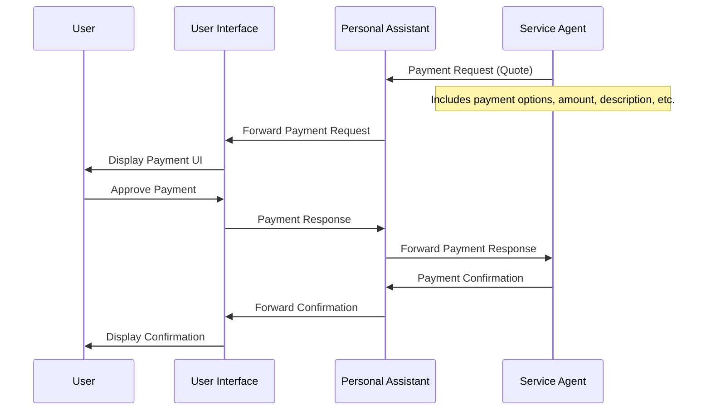
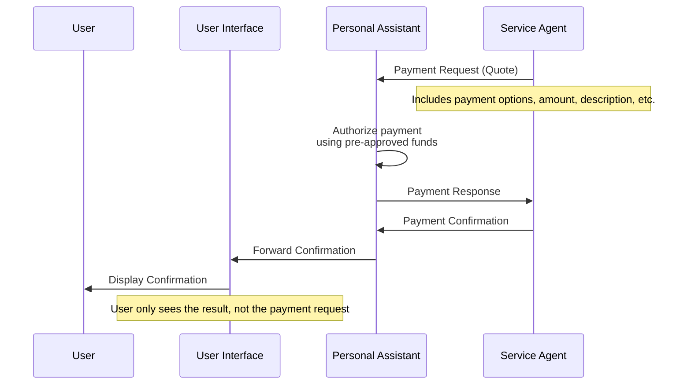
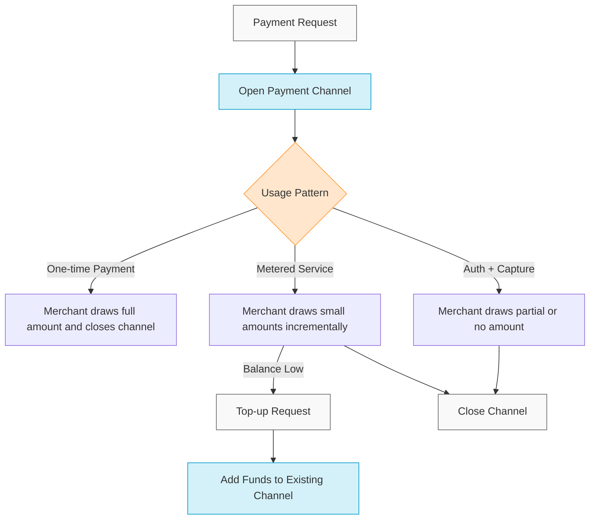
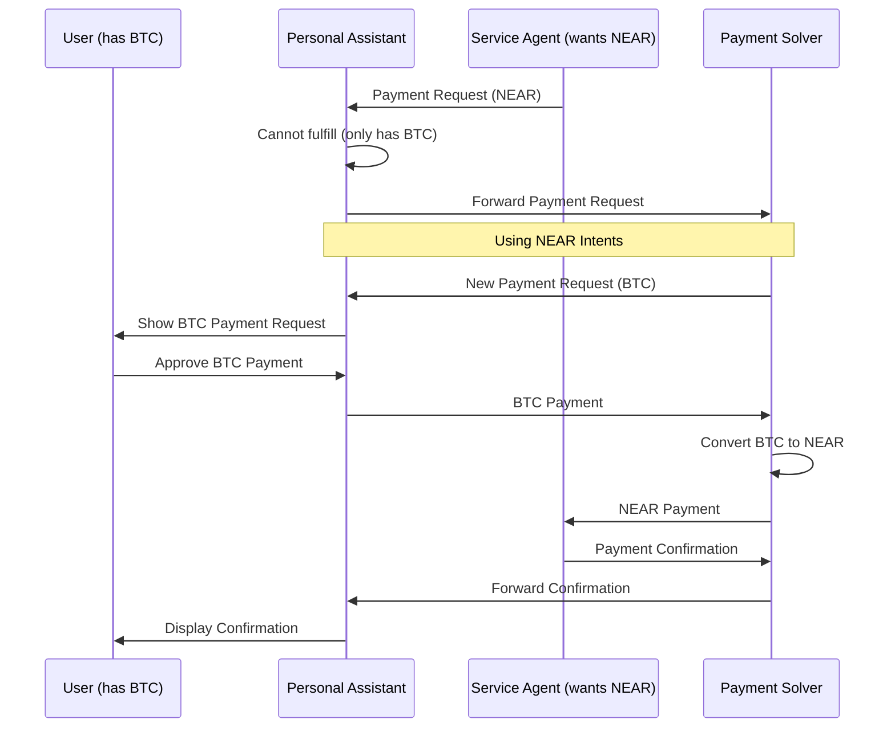
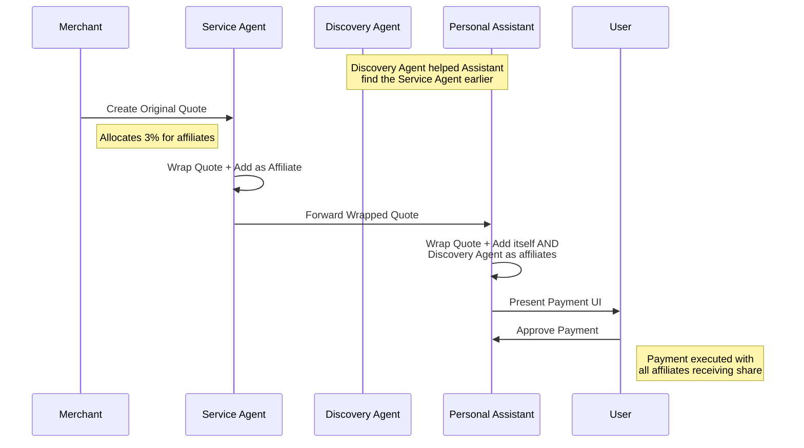

# AITP-01: Payments

* **Version**: 1.0.0
* **Spec Status**: Ideation
* **Implementation Status**: In Development

:::warning Ideation Phase
AITP-01 has a `schema.json` file, but the implementation is still being refined. The schema may evolve based on feedback and practical implementation experience. See the [Schema Reference](./schema-reference.md) for details on the current schema.
:::

## Overview

AITP-01 Payments provides a purpose-built payment protocol for user-to-agent and agent-to-agent transactions. Unlike traditional payment systems that rely on credit cards or direct blockchain transactions, AITP-01 is designed specifically for the agent ecosystem, supporting complex payment flows, metered services, and fair compensation for all participating agents.

## Why Crypto-Based Payments for Agents?

When agents are negotiating with each other on how to pay for things, they'll choose a payment protocol that is:

1. **Programmable**: Agents can execute complex payment logic without traditional banking limitations
2. **Low Cost**: Lower fees than credit card processing
3. **Incentivized**: Rewards every party that helped facilitate the transaction
4. **Secure**: Cryptographic verification without relying on centralized authorities
5. **Transparent**: All participating agents can verify transactions
6. **Global**: Works instantly across borders without currency conversion issues
7. **Composable**: Can be combined with other blockchain-based systems
8. **Automatable**: Supports micropayments and metered billing without human intervention

## Core Features

### Payment Request/Response Flow (User-Approved)



### Payment Request/Response Flow (Assistant-Handled)



When a service agent needs to request payment, it sends a payment request (Quote) that can flow upstream through assistants until it reaches an agent or UI that can handle payments. Any agent in the chain can decide to handle, modify, or reject the request.

**Example Payment Request:**
```json
{
  "$schema": "https://aitp.dev/capabilities/aitp-01-payments/v0.1.0/schema.json",
  "quote": {
    "quote_id": "q_123456789",
    "merchant_id": "store.near",
    "description": "Premium Subscription - Annual Plan",
    "expiration": "2025-03-01T12:00:00Z",
    "next_recipient": "service-agent.near",
    "payment_options": [
      {
        "amount": "99.99",
        "currency": "USD",
        "payment_methods": [
          {
            "type": "near_payment_channel",
            "token": "usdc.near",
            "recipient": "store.near"
          }
        ]
      }
    ],
    "revenue_share": {
      "affiliate_share_bps": 300, // 3% in basis points
      "affiliates": [
        {
          "id": "assistant.near",
          "role": "personal_assistant",
          "weight": 2
        },
        {
          "id": "discovery.near",
          "role": "discovery",
          "weight": 1
        }
      ]
    },
    "merchant_signature": "ed25519:..."
  }
}
```

**Example Payment Response:**
```json
{
  "$schema": "https://aitp.dev/capabilities/aitp-01-payments/v0.1.0/schema.json",
  "payment": {
    "quote_id": "q_123456789",
    "payment_method": {
      "type": "near_payment_channel",
      "token": "usdc.near",
      "channel_id": "ch_987654321",
      "amount": "99.99",
      "currency": "USD"
    },
    "payer_id": "user.near",
    "timestamp": "2025-02-25T08:32:15Z",
    "payer_signature": "ed25519:..."
  }
}
```

### Unified Payment Channel System

AITP-01 utilizes a unified payment channel system for one-time payments, metered services, and authorization/capture flows. All three use cases begin with opening a payment channel, but differ in how and when funds are drawn.



**Key aspects:**
- **One-time payments**: Merchant draws full amount and closes the channel
- **Metered services**: Merchant draws small amounts as service is used, may request top-ups
- **Auth/Capture**: Merchant may draw full, partial, or no amount based on final service delivery

### Dispute Resolution and Escrow

AITP-01 provides flexible options for handling payment disputes:

1. **Pluggable Dispute Resolution**: Parties can agree on a third-party arbitrator
2. **AI Judiciary**: Smart contracts can delegate dispute resolution to AI judges
3. **Escrow Mechanisms**: Funds can be held in escrow until conditions are met

The payment channel implementation allows for third-party dispute resolution, which can be either an AI agent or a human mediator.

### Multi-Chain Support

While initially launching with NEAR blockchain support, AITP-01 is designed to be blockchain-agnostic, with:

- Support for NEAR and NEAR-based tokens initially
- Planned support for Ethereum, Solana, and other major chains
- Cross-chain support through [NEAR Intents](https://near.org/intents)

### Cross-Chain Payment Flow



## Affiliate and Referral System

One of the most innovative aspects of AITP-01 is its built-in affiliate and referral system, ensuring that all agents participating in a transaction can receive fair compensation.

### How It Works:

1. A merchant creates a signed payment request that allocates a portion of the payment (e.g., 2-3%) to affiliates
2. As the payment request flows through agents, each can add itself and others as affiliates
3. When payment is completed, the smart contract automatically distributes the affiliate share

### Affiliate Flow Example:



**Example Wrapped Quote:**
```json
{
  "$schema": "https://aitp.dev/capabilities/aitp-01-payments/v0.1.0/schema.json",
  "wrapped_quote": {
    "original_quote": {
      "quote_id": "q_123456789",
      "merchant_id": "store.near",
      "description": "Premium Subscription - Annual Plan",
      "expiration": "2025-03-01T12:00:00Z",
      "next_recipient": "service-agent.near",
      "payment_options": [
        {
          "amount": "99.99",
          "currency": "USD",
          "payment_methods": [
            {
              "type": "near_payment_channel",
              "token": "usdc.near",
              "recipient": "store.near"
            }
          ]
        }
      ],
      "revenue_share": {
        "affiliate_share_bps": 300,
        "affiliates": []
      },
      "merchant_signature": "ed25519:..."
    },
    "wrappers": [
      {
        "affiliate_id": "service-agent.near",
        "role": "service",
        "added_affiliates": [],
        "next_recipient": "assistant.near",
        "timestamp": "2025-02-25T08:29:15Z",
        "signature": "ed25519:..."
      },
      {
        "affiliate_id": "assistant.near",
        "role": "personal_assistant",
        "added_affiliates": [
          {
            "id": "discovery.near",
            "role": "discovery",
            "weight": 1
          }
        ],
        "next_recipient": "user-interface.near",
        "timestamp": "2025-02-25T08:30:15Z",
        "signature": "ed25519:..."
      }
    ]
  }
}
```

### Affiliate Model Options:

We're considering several approaches for distributing affiliate fees:

- **Equal distribution**: All affiliates receive an equal portion
- **Role-based weighting**: Different roles (discovery, assistant, etc.) receive different percentages
- **Weight-based**: Affiliates are assigned weights that determine their share
- **Merchant-defined shares**: Merchant specifies exactly how fees are split

The specific distribution model is still being finalized and may be configurable by merchants.

## Technical Implementation

AITP-01 is built on a custom payment channel implementation that provides:

1. **One-way Payment Channels**: Funds flow from user to merchant with proper authorization
2. **Fee Distribution**: Automatic distribution of proceeds among merchant and affiliates
3. **Dispute Resolution**: Pluggable dispute resolution delegates
4. **Multi-token Support**: Works with NEAR and NEP-141 tokens initially

The underlying infrastructure is designed to be extensible to other blockchains as the protocol matures.

## Open Questions and Future Work

Several aspects of AITP-01 are still being finalized:

1. **Affiliate Fee Distribution**: How should the affiliate share be divided among participating agents?
2. **Subscription Handling**: Best patterns for recurring payments
3. **Cross-chain Standards**: Consistent identifiers for blockchains and tokens
4. **Mobile Wallet Integration**: Optimizing the flow for mobile wallets
5. **Implementation Reconciliation**: Should the payment channel implementation be reconciled with NEAR Intents into a unified system?

## Getting Started

AITP-01 Payments is currently under active development. The initial implementation will be available on the NEAR AI platform, with SDKs for integrating into other agent frameworks.

We welcome feedback and contributions to help shape the future of agent payments! Join the discussion on [GitHub](https://github.com/nearai/aitp) through issues, discussions, and pull requests.
