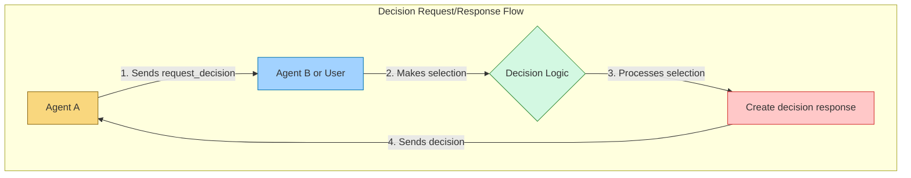
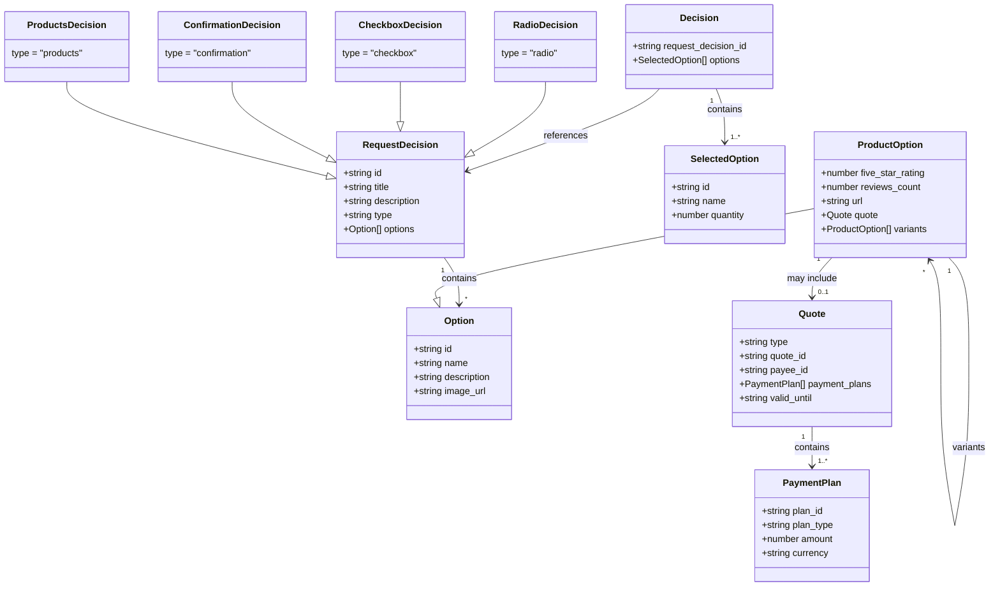

# AITP-02: Decisions

* Spec Status: Draft
* Implementation Status: Live on NEAR AI

:::note Auto-generated Documentation
This documentation was auto-generated from the schema and examples by an AI model.
:::



## Overview

The Decisions capability enables agents to request structured choices from users or other agents, and to receive structured responses to those requests. This capability is useful for a wide range of scenarios where an agent needs to collect a specific decision from the user or another agent.

## Schema

Schema URL: `https://aitp.dev/v1/decisions/schema.json`

The Decisions capability defines two primary message types:
1. `request_decision` - Sent by an agent to request a decision
2. `decision` - Sent in response to a request_decision message

## Message Types



### Request Decision

An agent sends a `request_decision` message when it needs the recipient to make a choice between options.

```json
{
  "$schema": "https://aitp.dev/v1/decisions/schema.json",
  "request_decision": {
    "id": "unique-decision-id",
    "title": "Optional title for the decision",
    "description": "Description of what the decision is about",
    "type": "radio|checkbox|confirmation|products",
    "options": [
      {
        "id": "option-id",
        "name": "Display name for the option",
        // Additional properties based on decision type
      },
      // More options...
    ]
  }
}
```

#### Decision Types

The `type` field determines how the decision should be presented to the user and what additional properties are available on options:

1. `radio` (default) - Select a single option from a list
2. `checkbox` - Select multiple options from a list
3. `confirmation` - A special case of radio for yes/no decisions
4. `products` - A specialized type for product selection with additional metadata

#### Common Option Properties

All option types support these properties:
- `id` (required): Unique identifier for the option
- `name`: Display name for the option
- `description`: Additional descriptive text
- `image_url`: URL to an image representing the option

#### Product-Specific Option Properties

For `type: "products"`, options may include:
- `short_variant_name`: A shorter name for the product variant
- `reviews_count`: Number of reviews
- `five_star_rating`: Rating on a 0-5 scale
- `url`: URL to product details
- `quote`: Payment information (integrates with AITP-01 Payments)
- `variants`: Array of product variants which themselves are options

#### Product Quote Structure

```json
"quote": {
  "type": "Quote",
  "quote_id": "unique-quote-id",
  "payee_id": "merchant-id",
  "payment_plans": [
    {
      "plan_id": "plan-id",
      "plan_type": "one-time",
      "amount": 199.99,
      "currency": "USD"
    }
  ],
  "valid_until": "2050-01-01T00:00:00Z"
}
```

### Decision Response

A client sends a `decision` message in response to a `request_decision`, indicating which option(s) were selected.

```json
{
  "$schema": "https://aitp.dev/v1/decisions/schema.json",
  "decision": {
    "request_decision_id": "id-from-the-request",
    "options": [
      {
        "id": "selected-option-id",
        "name": "Optional name of selected option",
        "quantity": 1 // Optional, for product selections
      },
      // More selected options if multiple selection is allowed
    ]
  }
}
```

## Examples

### Simple Radio Selection

Request:
```json
{
  "$schema": "https://aitp.dev/v1/decisions/schema.json",
  "request_decision": {
    "id": "7c42b9d6-107d-4f5f-8f23-f9014c6efdae",
    "description": "Select your favorite number:",
    "options": [
      { "id": "0", "name": "0" },
      { "id": "7", "name": "7" },
      { "id": "100", "name": "100" }
    ]
  }
}
```

Response:
```json
{
  "$schema": "https://aitp.dev/v1/decisions/schema.json",
  "decision": {
    "request_decision_id": "7c42b9d6-107d-4f5f-8f23-f9014c6efdae",
    "options": [
      { "id": "7", "name": "7" }
    ]
  }
}
```

### Confirmation Dialog

Request:
```json
{
  "$schema": "https://aitp.dev/v1/decisions/schema.json",
  "request_decision": {
    "id": "27ed3deb-39cb-4968-90dc-9cb456a470f2",
    "title": "Please confirm",
    "description": "Would you like to eat all cookies?",
    "type": "confirmation",
    "options": [
      { "id": "1", "name": "Yes, eat the cookies" },
      { "id": "2", "name": "No, that's not healthy" },
      { "id": "3", "name": "Something else" }
    ]
  }
}
```

### Multiple Selection (Checkbox)

Request:
```json
{
  "$schema": "https://aitp.dev/v1/decisions/schema.json",
  "request_decision": {
    "id": "50a53841-09ee-4b57-b5ec-561fe505f532",
    "title": "Your Favorite Colors",
    "description": "Which colors are your favorite?",
    "type": "checkbox",
    "options": [
      {
        "id": "blue",
        "name": "Blue",
        "description": "A calming color",
        "image_url": "https://example.com/blue.jpg"
      },
      {
        "id": "red",
        "name": "Red",
        "description": "An exciting color",
        "image_url": "https://example.com/red.jpg"
      },
      {
        "id": "green",
        "name": "Green",
        "description": "An earthy color",
        "image_url": "https://example.com/green.jpg"
      }
    ]
  }
}
```

Response with multiple selections:
```json
{
  "$schema": "https://aitp.dev/v1/decisions/schema.json",
  "decision": {
    "request_decision_id": "50a53841-09ee-4b57-b5ec-561fe505f532",
    "options": [
      { "id": "red", "name": "Red" },
      { "id": "blue", "name": "Blue" }
    ]
  }
}
```

### Product Selection

Request:
```json
{
  "$schema": "https://aitp.dev/v1/decisions/schema.json",
  "request_decision": {
    "id": "bd9b613c-6fa5-4797-ba91-547f0903da9f",
    "title": "Recommended Products",
    "description": "Based on your selected factors, here are the best recommendations",
    "type": "products",
    "options": [
      {
        "id": "product_1",
        "name": "JBL Tour One M2",
        "description": "A short, summarized description about the headphones",
        "five_star_rating": 4.2,
        "reviews_count": 132,
        "quote": {
          "type": "Quote",
          "payee_id": "foobar",
          "quote_id": "foobar",
          "payment_plans": [
            {
              "amount": 199.5,
              "currency": "USD",
              "plan_id": "foobar",
              "plan_type": "one-time"
            }
          ],
          "valid_until": "2050-01-01T00:00:00Z"
        },
        "image_url": "https://example.com/headphones1.jpg",
        "url": "https://example.com/product1"
      },
      // More product options...
    ]
  }
}
```

Response for product selection:
```json
{
  "$schema": "https://aitp.dev/v1/decisions/schema.json",
  "decision": {
    "request_decision_id": "bd9b613c-6fa5-4797-ba91-547f0903da9f",
    "options": [
      {
        "id": "product_1",
        "name": "JBL Tour One M2",
        "quantity": 1
      }
    ]
  }
}
```

## Implementation Considerations

### For UIs and Client Applications

When implementing the Decisions capability in a UI:

1. Render different UI controls based on the `type` field:
   - `radio`: Radio buttons or a single-select dropdown
   - `checkbox`: Checkboxes for multiple selection
   - `confirmation`: Styled as a confirmation dialog
   - `products`: Rich product cards with images and details

2. For product displays, consider showing:
   - Product images
   - Ratings and reviews
   - Price information from quotes
   - Variant selection options

3. Enable quantity selection for product types

### For Agents

When implementing the Decisions capability in an agent:

1. Be specific with decision requests - provide clear titles and descriptions
2. Use the appropriate type for the decision context
3. Provide rich metadata for options when available
4. Include image URLs when visual representation would be helpful
5. Handle partial or unexpected responses gracefully

## Integration with Other Capabilities

The Decisions capability works well with:

- **AITP-01: Payments** - Product selections can include payment quotes
- **AITP-03: Data Request** - Use Data Request for collecting form data and Decisions for choice selection
- **AITP-04: Transactions** - Use Decisions to confirm transactions before executing them

## Security and Privacy Considerations

- Option IDs should not contain sensitive information
- Product URLs and images should use HTTPS
- Personally identifiable information should not be included in decision requests
