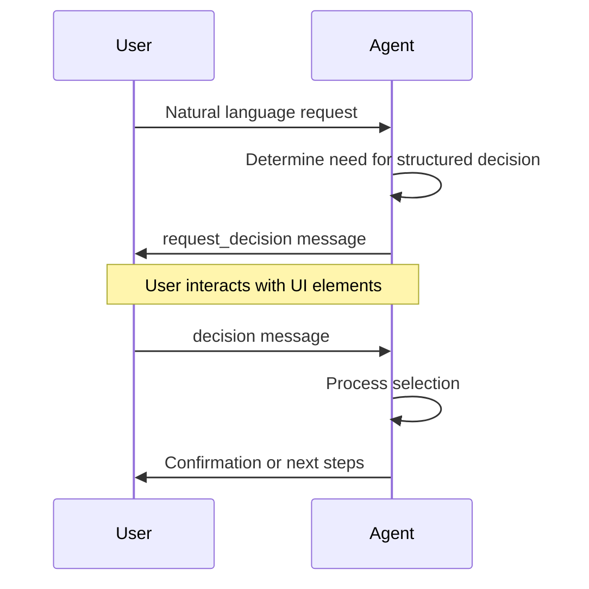
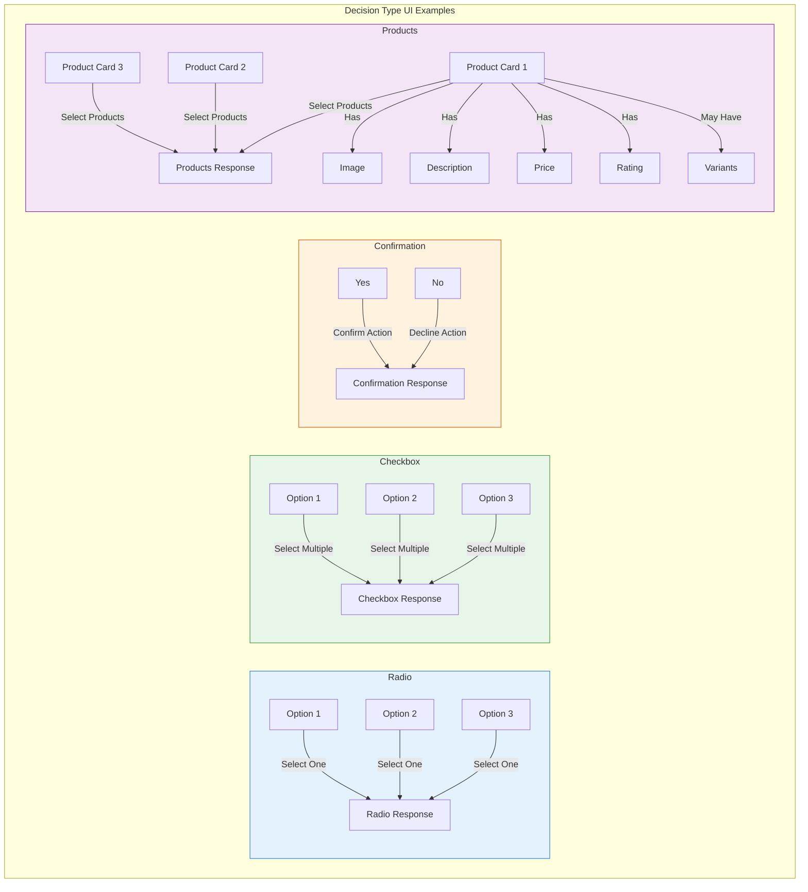

# AITP-02: Decisions Implementation Guide

* Spec Status: Draft
* Implementation Status: Live on NEAR AI

:::note Auto-generated Documentation
This documentation was auto-generated from the schema and examples by an AI model.
:::

This guide provides practical implementation details for developers integrating the AITP-02 Decisions capability into agents and user interfaces.



## Implementation for Agent Developers

### When to Use the Decisions Capability

Use the Decisions capability when your agent needs to:

1. Present choices to a user or another agent
2. Collect structured selection data 
3. Present product options with rich metadata
4. Enable multi-selection of options

### Request Decision Generation

```javascript
// Example JavaScript for generating a request_decision message
function createRequestDecision(options) {
  return {
    "$schema": "https://aitp.dev/v1/decisions/schema.json",
    "request_decision": {
      "id": generateUniqueId(), // Use UUID or similar
      "title": options.title || "",
      "description": options.description || "",
      "type": options.type || "radio",
      "options": options.items.map(item => ({
        "id": item.id,
        "name": item.name,
        // Add other properties based on item type
      }))
    }
  };
}
```

### Processing Decision Responses

```javascript
// Example JavaScript for handling a decision response
function handleDecision(decision) {
  // Find the original request
  const requestId = decision.decision.request_decision_id;
  const originalRequest = findRequestById(requestId);
  
  // Process selected options
  const selectedOptions = decision.decision.options;
  
  // For a single selection
  if (originalRequest.request_decision.type === "radio" ||
      originalRequest.request_decision.type === "confirmation") {
    const selectedOption = selectedOptions[0];
    // Take action based on selection
  }
  
  // For multiple selections
  if (originalRequest.request_decision.type === "checkbox") {
    // Process each selected option
    selectedOptions.forEach(option => {
      // Take action based on each selection
    });
  }
  
  // For product selection
  if (originalRequest.request_decision.type === "products") {
    selectedOptions.forEach(product => {
      const quantity = product.quantity || 1;
      // Process product selection with quantity
    });
  }
}
```

### Best Practices for Agent Developers

1. **Clear Context**: Provide enough context in the `description` so users understand why they're making this decision.

2. **Appropriate Types**:
   - Use `radio` for single selections from few options
   - Use `checkbox` when multiple selections are valid
   - Use `confirmation` for yes/no/maybe decisions
   - Use `products` for e-commerce style selections

3. **Option Organization**:
   - Limit options to a reasonable number (typically 3-7 for best UX)
   - Order options logically (alphabetical, price, popularity)
   - Use variants for product options with small differences
   
4. **Rich Metadata**:
   - Include images when visual representation helps
   - For products, include ratings, prices, and descriptions
   - Use short, descriptive option names

5. **Resilient Handling**:
   - Be prepared to handle unexpected or partial selections
   - Have fallback behaviors if decisions aren't provided
   - Store decision requests to match with responses later

## Implementation for UI Developers

### Rendering Different Decision Types



#### Radio Selection

```jsx
// React example for rendering radio selection
function RadioDecision({ request, onSubmit }) {
  const [selected, setSelected] = useState(null);
  
  const handleSubmit = () => {
    if (selected) {
      onSubmit({
        "$schema": "https://aitp.dev/v1/decisions/schema.json",
        "decision": {
          "request_decision_id": request.request_decision.id,
          "options": [{ "id": selected }]
        }
      });
    }
  };
  
  return (
    <div className="decision-container">
      <h3>{request.request_decision.title}</h3>
      <p>{request.request_decision.description}</p>
      
      <div className="options">
        {request.request_decision.options.map(option => (
          <div key={option.id} className="radio-option">
            <input
              type="radio"
              id={option.id}
              name="decision"
              checked={selected === option.id}
              onChange={() => setSelected(option.id)}
            />
            <label htmlFor={option.id}>
              {option.name}
              {option.description && <p className="description">{option.description}</p>}
            </label>
          </div>
        ))}
      </div>
      
      <button onClick={handleSubmit} disabled={!selected}>Submit</button>
    </div>
  );
}
```

#### Checkbox Selection

```jsx
// React example for rendering checkbox selection
function CheckboxDecision({ request, onSubmit }) {
  const [selected, setSelected] = useState({});
  
  const toggleOption = (id) => {
    setSelected(prev => ({
      ...prev,
      [id]: !prev[id]
    }));
  };
  
  const handleSubmit = () => {
    const selectedOptions = Object.entries(selected)
      .filter(([_, isSelected]) => isSelected)
      .map(([id]) => {
        const option = request.request_decision.options.find(o => o.id === id);
        return { "id": id, "name": option.name };
      });
    
    if (selectedOptions.length > 0) {
      onSubmit({
        "$schema": "https://aitp.dev/v1/decisions/schema.json",
        "decision": {
          "request_decision_id": request.request_decision.id,
          "options": selectedOptions
        }
      });
    }
  };
  
  return (
    <div className="decision-container">
      <h3>{request.request_decision.title}</h3>
      <p>{request.request_decision.description}</p>
      
      <div className="options">
        {request.request_decision.options.map(option => (
          <div key={option.id} className="checkbox-option">
            <input
              type="checkbox"
              id={option.id}
              checked={selected[option.id] || false}
              onChange={() => toggleOption(option.id)}
            />
            <label htmlFor={option.id}>
              {option.name}
              {option.description && <p className="description">{option.description}</p>}
            </label>
          </div>
        ))}
      </div>
      
      <button onClick={handleSubmit} disabled={Object.values(selected).every(v => !v)}>
        Submit
      </button>
    </div>
  );
}
```

#### Product Selection

```jsx
// React example for rendering product selection
function ProductsDecision({ request, onSubmit }) {
  const [selected, setSelected] = useState({});
  const [quantities, setQuantities] = useState({});
  
  const selectProduct = (id) => {
    setSelected(prev => {
      const newSelected = {...prev};
      // If product is already selected, remove it, otherwise add it
      if (newSelected[id]) {
        delete newSelected[id];
      } else {
        newSelected[id] = true;
      }
      return newSelected;
    });
    
    // Initialize quantity to 1 if not already set
    if (!quantities[id]) {
      setQuantities(prev => ({...prev, [id]: 1}));
    }
  };
  
  const updateQuantity = (id, quantity) => {
    if (quantity < 1) quantity = 1;
    setQuantities(prev => ({...prev, [id]: quantity}));
    
    // Ensure product is selected when quantity is set
    if (!selected[id]) {
      setSelected(prev => ({...prev, [id]: true}));
    }
  };
  
  const handleSubmit = () => {
    const selectedOptions = Object.keys(selected)
      .map(id => {
        const option = request.request_decision.options.find(o => o.id === id);
        return {
          "id": id,
          "name": option.name,
          "quantity": quantities[id] || 1
        };
      });
    
    if (selectedOptions.length > 0) {
      onSubmit({
        "$schema": "https://aitp.dev/v1/decisions/schema.json",
        "decision": {
          "request_decision_id": request.request_decision.id,
          "options": selectedOptions
        }
      });
    }
  };
  
  return (
    <div className="products-container">
      <h3>{request.request_decision.title}</h3>
      <p>{request.request_decision.description}</p>
      
      <div className="product-grid">
        {request.request_decision.options.map(product => (
          <div key={product.id} className={`product-card ${selected[product.id] ? 'selected' : ''}`}>
            {product.image_url && (
              
            )}
            
            <div className="product-info">
              <h4>{product.name}</h4>
              {product.description && <p>{product.description}</p>}
              
              {product.five_star_rating && (
                <div className="rating">
                  ★ {product.five_star_rating.toFixed(1)}
                  {product.reviews_count && <span>({product.reviews_count} reviews)</span>}
                </div>
              )}
              
              {product.quote && (
                <div className="price">
                  ${product.quote.payment_plans[0].amount.toFixed(2)} {product.quote.payment_plans[0].currency}
                </div>
              )}
              
              <div className="product-actions">
                <input
                  type="checkbox"
                  checked={selected[product.id] || false}
                  onChange={() => selectProduct(product.id)}
                />
                <label>Select</label>
                
                {selected[product.id] && (
                  <div className="quantity">
                    <button onClick={() => updateQuantity(product.id, (quantities[product.id] || 1) - 1)}>-</button>
                    <input
                      type="number"
                      min="1"
                      value={quantities[product.id] || 1}
                      onChange={(e) => updateQuantity(product.id, parseInt(e.target.value))}
                    />
                    <button onClick={() => updateQuantity(product.id, (quantities[product.id] || 1) + 1)}>+</button>
                  </div>
                )}
              </div>
            </div>
          </div>
        ))}
      </div>
      
      <button onClick={handleSubmit} disabled={Object.keys(selected).length === 0}>
        Submit Selection
      </button>
    </div>
  );
}
```

### Handling Decision Variants

For product options with variants:

```jsx
function ProductVariantSelector({ product, onSelect }) {
  const [expandedVariants, setExpandedVariants] = useState(false);
  
  // If product has variants, render a dropdown or expansion panel
  if (product.variants && product.variants.length > 0) {
    return (
      <div className="product-with-variants">
        <div className="main-product" onClick={() => setExpandedVariants(!expandedVariants)}>
          <h4>{product.name}</h4>
          <button>{expandedVariants ? "Hide Variants" : "Show Variants"}</button>
        </div>
        
        {expandedVariants && (
          <div className="variants-container">
            {product.variants.map(variant => (
              <div key={variant.id} className="variant" onClick={() => onSelect(variant)}>
                {variant.image_url && }
                <div className="variant-details">
                  <span className="variant-name">{variant.short_variant_name || variant.name}</span>
                  {variant.quote && (
                    <span className="variant-price">
                      ${variant.quote.payment_plans[0].amount.toFixed(2)}
                    </span>
                  )}
                </div>
              </div>
            ))}
          </div>
        )}
      </div>
    );
  }
  
  // If no variants, just render the product normally
  return (
    <div className="product" onClick={() => onSelect(product)}>
      <h4>{product.name}</h4>
      {/* ... other product details ... */}
    </div>
  );
}
```

## Best Practices for UI Developers

1. **Responsive Design**:
   - Ensure decisions render well on mobile and desktop
   - Use grid layouts for products that adjust to screen size
   - Make tap/click targets large enough for easy interaction

2. **Visual Hierarchy**:
   - Make selected state clearly visible
   - Use color, size and positioning to indicate importance
   - Show related options (like variants) with clear relationship

3. **Accessibility**:
   - Ensure all controls are keyboard navigable
   - Use proper form semantics (fieldset/legend for option groups)
   - Include alt text for all images
   - Ensure sufficient color contrast

4. **User Feedback**:
   - Show clear confirmation when selections are made
   - Indicate when a decision has been submitted
   - Consider animations for state changes

5. **Error Handling**:
   - Validate selections before submission
   - Show friendly error messages for invalid selections
   - Provide a way to reset or cancel decisions

## Testing

When testing AITP-02 Decisions implementation:

1. Test all decision types with various option counts
2. Verify single vs. multiple selection behavior
3. Test with long text and image loading failures
4. Verify response format matches the schema exactly
5. Test with minimum required fields and with all optional fields

## Security Considerations

1. Sanitize all content from request_decision before rendering
2. Validate decision responses against the schema
3. Verify request_decision_id matches an expected request
4. Only load images from trusted sources
5. Implement CSRF protection for decision submissions

## Performance Considerations

1. Lazy-load images for product listings
2. Consider pagination for large option sets
3. Minimize state updates when handling user interactions
4. Cache product metadata when appropriate
