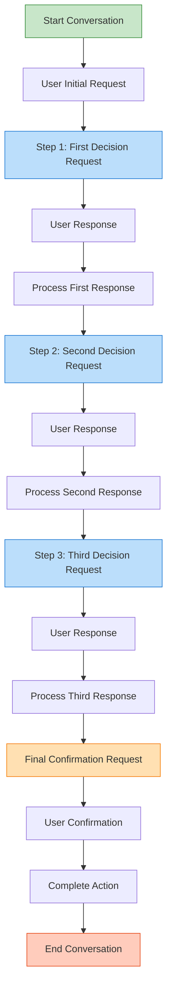

# AITP-02: Sample Decision Flows

* Spec Status: Draft
* Implementation Status: Live on NEAR AI

:::note Auto-generated Documentation
This documentation was auto-generated from the schema and examples by an AI model.
:::

This document provides examples of common decision flows using the AITP-02 Decisions capability.



## E-commerce Product Selection Flow

This flow demonstrates how an agent can present product options to a user and process their selection.

### Step 1: User requests product recommendations

```
User: I'm looking for noise-cancelling headphones under $300.
```

### Step 2: Agent sends a product decision request

```json
{
  "$schema": "https://aitp.dev/v1/decisions/schema.json",
  "request_decision": {
    "id": "bd9b613c-6fa5-4797-ba91-547f0903da9f",
    "title": "Recommended Headphones",
    "description": "Based on your budget and requirements, here are some noise-cancelling headphones under $300:",
    "type": "products",
    "options": [
      {
        "id": "product_1",
        "name": "JBL Tour One M2",
        "description": "Adaptive noise cancellation with up to 30 hours of battery life",
        "five_star_rating": 4.2,
        "reviews_count": 132,
        "quote": {
          "type": "Quote",
          "payee_id": "jbl-store",
          "quote_id": "jbl-tour-one-m2",
          "payment_plans": [
            {
              "amount": 199.5,
              "currency": "USD",
              "plan_id": "one-time-standard",
              "plan_type": "one-time"
            }
          ],
          "valid_until": "2025-03-01T00:00:00Z"
        },
        "image_url": "https://example.com/jbl-tour-one-m2.jpg",
        "url": "https://example.com/jbl-tour-one-m2"
      },
      {
        "id": "product_2",
        "name": "Soundcore by Anker Space One",
        "description": "Budget-friendly with adaptive noise cancellation and 40-hour playtime",
        "five_star_rating": 3.5,
        "reviews_count": 256,
        "quote": {
          "type": "Quote",
          "payee_id": "anker-store",
          "quote_id": "soundcore-space-one",
          "payment_plans": [
            {
              "amount": 79.99,
              "currency": "USD",
              "plan_id": "one-time-standard",
              "plan_type": "one-time"
            }
          ],
          "valid_until": "2025-03-01T00:00:00Z"
        },
        "image_url": "https://example.com/soundcore-space-one.jpg",
        "url": "https://example.com/soundcore-space-one",
        "variants": [
          {
            "id": "product_2_black",
            "name": "Soundcore by Anker Space One - Jet Black",
            "short_variant_name": "Jet Black",
            "five_star_rating": 3.75,
            "quote": {
              "type": "Quote",
              "payee_id": "anker-store",
              "quote_id": "soundcore-space-one-black",
              "payment_plans": [
                {
                  "amount": 89.99,
                  "currency": "USD",
                  "plan_id": "one-time-standard",
                  "plan_type": "one-time"
                }
              ],
              "valid_until": "2025-03-01T00:00:00Z"
            },
            "image_url": "https://example.com/soundcore-space-one-black.jpg",
            "url": "https://example.com/soundcore-space-one-black"
          }
        ]
      }
    ]
  }
}
```

### Step 3: User selects a product

```json
{
  "$schema": "https://aitp.dev/v1/decisions/schema.json",
  "decision": {
    "request_decision_id": "bd9b613c-6fa5-4797-ba91-547f0903da9f",
    "options": [
      {
        "id": "product_1",
        "name": "JBL Tour One M2",
        "quantity": 1
      }
    ]
  }
}
```

### Step 4: Agent confirms selection and provides next steps

```
Agent: Great choice! You've selected the JBL Tour One M2 headphones for $199.50. 
These offer adaptive noise cancellation with up to 30 hours of battery life.

Would you like to proceed with the purchase or would you like to see more options?
```

## Multi-step Configuration Flow

This flow shows how decisions can be used to guide users through a multi-step configuration process.

### Step 1: User initiates configuration

```
User: I want to set up a new cloud server for my application.
```

### Step 2: Agent asks for server type

```json
{
  "$schema": "https://aitp.dev/v1/decisions/schema.json",
  "request_decision": {
    "id": "server-type-selection",
    "title": "Server Type",
    "description": "What type of server best fits your application needs?",
    "type": "radio",
    "options": [
      {
        "id": "web-server",
        "name": "Web Server",
        "description": "Optimized for serving web content and applications"
      },
      {
        "id": "db-server",
        "name": "Database Server",
        "description": "Optimized for database workloads with high I/O performance"
      },
      {
        "id": "compute-server",
        "name": "Compute Server",
        "description": "Optimized for CPU-intensive workloads"
      }
    ]
  }
}
```

### Step 3: User selects server type

```json
{
  "$schema": "https://aitp.dev/v1/decisions/schema.json",
  "decision": {
    "request_decision_id": "server-type-selection",
    "options": [
      {
        "id": "web-server",
        "name": "Web Server"
      }
    ]
  }
}
```

### Step 4: Agent asks for performance tier

```json
{
  "$schema": "https://aitp.dev/v1/decisions/schema.json",
  "request_decision": {
    "id": "performance-tier",
    "title": "Performance Tier",
    "description": "Select the performance tier for your web server:",
    "type": "radio",
    "options": [
      {
        "id": "basic",
        "name": "Basic",
        "description": "1 vCPU, 2GB RAM, $20/month"
      },
      {
        "id": "standard",
        "name": "Standard",
        "description": "2 vCPU, 4GB RAM, $40/month"
      },
      {
        "id": "premium",
        "name": "Premium",
        "description": "4 vCPU, 8GB RAM, $80/month"
      }
    ]
  }
}
```

### Step 5: User selects performance tier

```json
{
  "$schema": "https://aitp.dev/v1/decisions/schema.json",
  "decision": {
    "request_decision_id": "performance-tier",
    "options": [
      {
        "id": "standard",
        "name": "Standard"
      }
    ]
  }
}
```

### Step 6: Agent asks for additional features

```json
{
  "$schema": "https://aitp.dev/v1/decisions/schema.json",
  "request_decision": {
    "id": "additional-features",
    "title": "Additional Features",
    "description": "Select any additional features you need:",
    "type": "checkbox",
    "options": [
      {
        "id": "backup",
        "name": "Daily Backups",
        "description": "+$10/month"
      },
      {
        "id": "monitoring",
        "name": "Advanced Monitoring",
        "description": "+$15/month"
      },
      {
        "id": "cdn",
        "name": "Content Delivery Network",
        "description": "+$25/month"
      }
    ]
  }
}
```

### Step 7: User selects additional features

```json
{
  "$schema": "https://aitp.dev/v1/decisions/schema.json",
  "decision": {
    "request_decision_id": "additional-features",
    "options": [
      {
        "id": "backup",
        "name": "Daily Backups"
      },
      {
        "id": "monitoring",
        "name": "Advanced Monitoring"
      }
    ]
  }
}
```

### Step 8: Agent confirms configuration and requests final approval

```json
{
  "$schema": "https://aitp.dev/v1/decisions/schema.json",
  "request_decision": {
    "id": "final-confirmation",
    "title": "Review and Confirm",
    "description": "Please review your server configuration:\n\n- Type: Web Server\n- Tier: Standard (2 vCPU, 4GB RAM)\n- Features: Daily Backups, Advanced Monitoring\n- Total monthly cost: $65\n\nWould you like to proceed with this configuration?",
    "type": "confirmation",
    "options": [
      {
        "id": "yes",
        "name": "Yes, create this server"
      },
      {
        "id": "no",
        "name": "No, I need to make changes"
      }
    ]
  }
}
```

### Step 9: User confirms

```json
{
  "$schema": "https://aitp.dev/v1/decisions/schema.json",
  "decision": {
    "request_decision_id": "final-confirmation",
    "options": [
      {
        "id": "yes",
        "name": "Yes, create this server"
      }
    ]
  }
}
```

### Step 10: Agent confirms the action

```
Agent: Great! I'm creating your web server with the Standard tier and additional backup and monitoring features. The total monthly cost will be $65. Your server will be available in approximately 5-10 minutes.
```

## Preference Collection Flow

This flow demonstrates how an agent can collect user preferences to personalize recommendations.

### Step 1: User requests personalized recommendations

```
User: I'm looking for a new fiction book to read. Can you recommend something?
```

### Step 2: Agent collects genre preferences

```json
{
  "$schema": "https://aitp.dev/v1/decisions/schema.json",
  "request_decision": {
    "id": "book-genres",
    "title": "Book Genres",
    "description": "Which genres are you interested in?",
    "type": "checkbox",
    "options": [
      {
        "id": "sci-fi",
        "name": "Science Fiction",
        "image_url": "https://example.com/icons/sci-fi.png"
      },
      {
        "id": "fantasy",
        "name": "Fantasy",
        "image_url": "https://example.com/icons/fantasy.png"
      },
      {
        "id": "mystery",
        "name": "Mystery/Thriller",
        "image_url": "https://example.com/icons/mystery.png"
      },
      {
        "id": "romance",
        "name": "Romance",
        "image_url": "https://example.com/icons/romance.png"
      },
      {
        "id": "historical",
        "name": "Historical Fiction",
        "image_url": "https://example.com/icons/historical.png"
      }
    ]
  }
}
```

### Step 3: User selects genres

```json
{
  "$schema": "https://aitp.dev/v1/decisions/schema.json",
  "decision": {
    "request_decision_id": "book-genres",
    "options": [
      {
        "id": "sci-fi",
        "name": "Science Fiction"
      },
      {
        "id": "fantasy",
        "name": "Fantasy"
      }
    ]
  }
}
```

### Step 4: Agent collects reading preferences

```json
{
  "$schema": "https://aitp.dev/v1/decisions/schema.json",
  "request_decision": {
    "id": "reading-preferences",
    "title": "Reading Preferences",
    "description": "What type of books do you prefer?",
    "type": "radio",
    "options": [
      {
        "id": "series",
        "name": "Series",
        "description": "Multiple books in the same universe"
      },
      {
        "id": "standalone",
        "name": "Standalone",
        "description": "Complete story in one book"
      },
      {
        "id": "no-preference",
        "name": "No preference",
        "description": "I'm open to both options"
      }
    ]
  }
}
```

### Step 5: User provides reading preferences

```json
{
  "$schema": "https://aitp.dev/v1/decisions/schema.json",
  "decision": {
    "request_decision_id": "reading-preferences",
    "options": [
      {
        "id": "standalone",
        "name": "Standalone"
      }
    ]
  }
}
```

### Step 6: Agent presents book recommendations

```json
{
  "$schema": "https://aitp.dev/v1/decisions/schema.json",
  "request_decision": {
    "id": "book-recommendations",
    "title": "Recommended Books",
    "description": "Based on your preferences for science fiction and fantasy standalone novels, here are some recommendations:",
    "type": "products",
    "options": [
      {
        "id": "book1",
        "name": "The Priory of the Orange Tree",
        "description": "An epic fantasy standalone about a world on the brink of war with dragons--and the women who must lead the fight to save it.",
        "five_star_rating": 4.1,
        "reviews_count": 1526,
        "image_url": "https://example.com/book1.jpg",
        "url": "https://example.com/book/priory"
      },
      {
        "id": "book2",
        "name": "Project Hail Mary",
        "description": "A lone astronaut must save the earth from disaster in this incredible new science-based thriller from the #1 New York Times bestselling author of The Martian.",
        "five_star_rating": 4.7,
        "reviews_count": 2341,
        "image_url": "https://example.com/book2.jpg",
        "url": "https://example.com/book/hail-mary"
      },
      {
        "id": "book3",
        "name": "The Starless Sea",
        "description": "A timeless love story set in a secret underground world—a place of pirates, painters, lovers, liars, and ships that sail upon a starless sea.",
        "five_star_rating": 4.0,
        "reviews_count": 1872,
        "image_url": "https://example.com/book3.jpg",
        "url": "https://example.com/book/starless-sea"
      }
    ]
  }
}
```

### Step 7: User selects a book

```json
{
  "$schema": "https://aitp.dev/v1/decisions/schema.json",
  "decision": {
    "request_decision_id": "book-recommendations",
    "options": [
      {
        "id": "book2",
        "name": "Project Hail Mary"
      }
    ]
  }
}
```

### Step 8: Agent provides detailed information

```
Agent: Great choice! "Project Hail Mary" by Andy Weir is a highly acclaimed science fiction novel with a 4.7/5 rating from over 2,300 readers.

The book follows Ryland Grace, who wakes up on a spaceship with no memory of who he is or how he got there. As his memory slowly returns, he realizes he's humanity's last hope to save Earth from an extinction-level threat.

Like Weir's debut "The Martian," this book features rigorous scientific problem-solving and an engaging protagonist with a sense of humor. Would you like me to find where you can purchase this book?
```

## Best Practices from these Examples

1. **Progressive Disclosure**: Start with broad choices and narrow down options (e.g., server type → performance tier → features)

2. **Contextual Decisions**: Frame decision requests in the context of the conversation

3. **Visual Enrichment**: Use images where appropriate to enhance understanding

4. **Confirmation Steps**: Use confirmation type decisions for important or costly actions

5. **Appropriate Decision Types**: Match the decision type to the content:
   - Use `radio` for single selections from a small set
   - Use `checkbox` for multiple selections
   - Use `products` for commercial items
   - Use `confirmation` for yes/no decisions

6. **Rich Metadata**: Include ratings, prices, and descriptions to aid decision-making

7. **Natural Follow-up**: Continue the conversation naturally after receiving decisions
