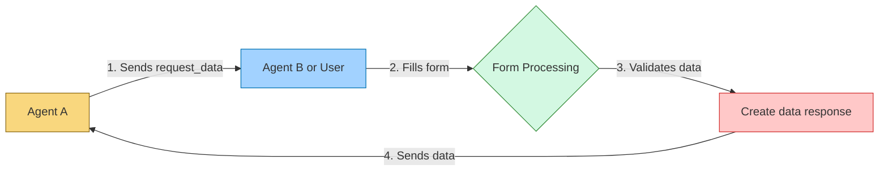
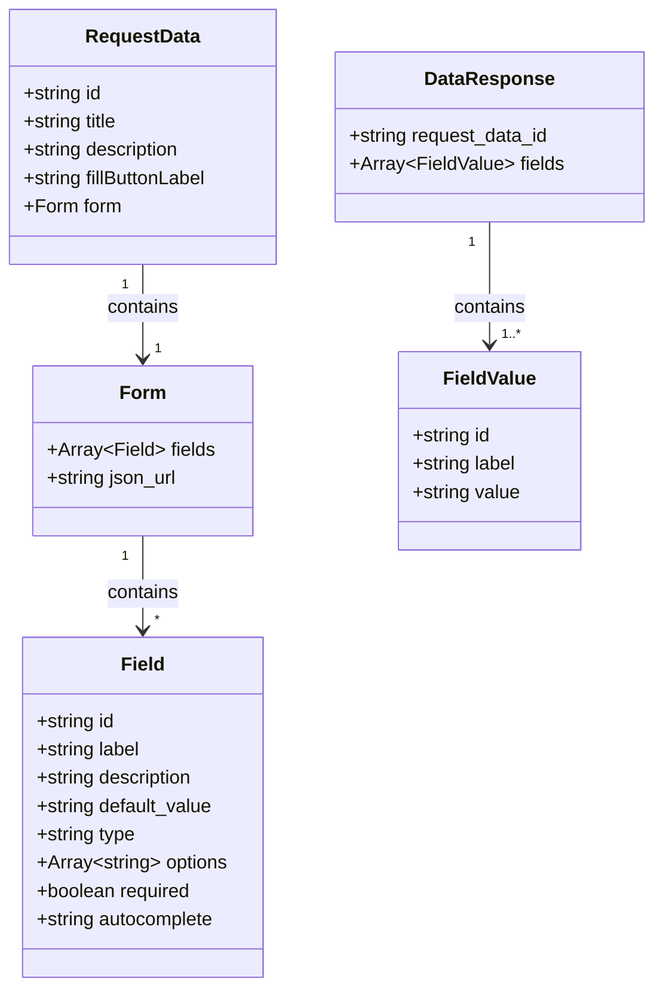

# AITP-03: Data Request

* Spec Status: Draft
* Implementation Status: Live on NEAR AI

:::note Auto-generated Documentation
This documentation was auto-generated from the schema and examples by an AI model.
:::

## Overview



The Data Request capability enables agents to request structured form data from users or other agents, and to receive structured responses to those requests. This capability is useful when an agent needs to collect specific information in a structured format, such as contact details, shipping addresses, preferences, or any other type of form data.

## Schema

Schema URL: `https://aitp.dev/capabilities/aitp-03-data-request/v1.0.0/schema.json`

The Data Request capability defines two primary message types:
1. `request_data` - Sent by an agent to request form data
2. `data` - Sent in response to a request_data message

## Message Types



### Request Data

An agent sends a `request_data` message when it needs to collect structured information from the recipient.

```json
{
  "$schema": "https://aitp.dev/capabilities/aitp-03-data-request/v1.0.0/schema.json",
  "request_data": {
    "id": "unique-form-id",
    "title": "Form title",
    "description": "Description of what information is needed",
    "fillButtonLabel": "Custom button text",
    "form": {
      "fields": [
        {
          "id": "field-id",
          "label": "Field label",
          "description": "Help text",
          "default_value": "Default value",
          "type": "text|number|email|textarea|select|combobox|tel",
          "options": ["Option 1", "Option 2"],
          "required": true|false,
          "autocomplete": "autocomplete hint"
        },
        // More fields...
      ]
    }
  }
}
```

Alternatively, the form can reference an external JSON specification via URL:

```json
{
  "$schema": "https://aitp.dev/capabilities/aitp-03-data-request/v1.0.0/schema.json",
  "request_data": {
    "id": "unique-form-id",
    "title": "Form title",
    "description": "Description of what information is needed",
    "fillButtonLabel": "Custom button text",
    "form": {
      "json_url": "https://example.com/form-definition.json"
    }
  }
}
```

#### Field Types

The `type` field determines how the input should be presented to the user:

1. `text` (default) - Standard text input
2. `number` - Numeric input
3. `email` - Email address input with validation
4. `textarea` - Multi-line text input
5. `select` - Dropdown selection from options
6. `combobox` - Combination of dropdown and text input
7. `tel` - Telephone number input

Each field type has appropriate validation built in.

### Data Response

A client sends a `data` message in response to a `request_data`, providing the requested information.

```json
{
  "$schema": "https://aitp.dev/capabilities/aitp-03-data-request/v1.0.0/schema.json",
  "data": {
    "request_data_id": "id-from-the-request",
    "fields": [
      {
        "id": "field-id",
        "label": "Field label",
        "value": "User-provided value"
      },
      // More field values...
    ]
  }
}
```

## Examples

### Basic Form Request

Request:
```json
{
  "$schema": "https://aitp.dev/capabilities/aitp-03-data-request/v1.0.0/schema.json",
  "request_data": {
    "id": "5aabab1d-c053-49fc-bdd1-f432c89a1664",
    "title": "Your Favorites",
    "description": "This info will help us recommend better products.",
    "fillButtonLabel": "Fill out favorites",
    "form": {
      "fields": [
        {
          "id": "favorite_color",
          "default_value": "Red",
          "label": "Favorite Color",
          "options": ["Red", "Green", "Blue"],
          "required": true,
          "type": "select"
        },
        {
          "id": "favorite_number",
          "label": "Favorite Number",
          "required": false,
          "type": "number"
        },
        {
          "id": "favorite_email",
          "label": "Favorite Email",
          "required": true,
          "type": "email"
        }
      ]
    }
  }
}
```

Response:
```json
{
  "$schema": "https://aitp.dev/capabilities/aitp-03-data-request/v1.0.0/schema.json",
  "data": {
    "request_data_id": "5aabab1d-c053-49fc-bdd1-f432c89a1664",
    "fields": [
      {
        "id": "favorite_color",
        "label": "Favorite Color",
        "value": "Blue"
      },
      {
        "id": "favorite_number",
        "label": "Favorite Number",
        "value": "7"
      },
      {
        "id": "favorite_email",
        "label": "Favorite Email",
        "value": "user@example.com"
      }
    ]
  }
}
```

### External Form Definition

Request:
```json
{
  "$schema": "https://aitp.dev/capabilities/aitp-03-data-request/v1.0.0/schema.json",
  "request_data": {
    "id": "c00d9f0c-89a7-4a74-8c57-0b9aa16be348",
    "title": "Shipping Info (International)",
    "description": "Great! Let's start with your shipping info.",
    "fillButtonLabel": "Fill out shipping info",
    "form": {
      "json_url": "https://app.near.ai/api/v1/aitp/data/forms/shipping_address_international.json"
    }
  }
}
```

## Implementation Considerations

### For UIs and Client Applications

When implementing the Data Request capability in a UI:

1. Render appropriate input controls based on the `type` field for each form field:
   - `text`: Text input
   - `number`: Number input with appropriate validation
   - `email`: Email input with validation
   - `textarea`: Multi-line text area
   - `select`: Dropdown selection
   - `combobox`: Dropdown with custom entry option
   - `tel`: Telephone input with appropriate formatting

2. Handle validation based on field requirements:
   - Respect the `required` property
   - Validate input based on type (e.g., email format)
   - Show appropriate error messages

3. Support external form definitions:
   - Fetch form definitions from `json_url` when provided
   - Handle loading states and errors

### For Agents

When implementing the Data Request capability in an agent:

1. Be specific with data requests - provide clear titles and descriptions
2. Use appropriate field types for the expected data
3. Provide helpful default values and options when applicable
4. Set appropriate required fields to ensure complete data collection
5. Handle partial or missing responses gracefully

## Integration with Other Capabilities

The Data Request capability works well with:

- **AITP-02: Decisions** - Use Data Request for collecting detailed form information after users make high-level decisions
- **AITP-01: Payments** - Collect billing and shipping information before payment processing
- **AITP-04: Transactions** - Gather necessary details before executing transactions

## Security and Privacy Considerations

- Field IDs should not contain sensitive information
- Consider what data is truly necessary to request
- Use appropriate autocomplete attributes to help users securely fill forms
- Consider providing privacy information in the form description
- Be explicit about how collected data will be used
- Do not request sensitive data unnecessarily