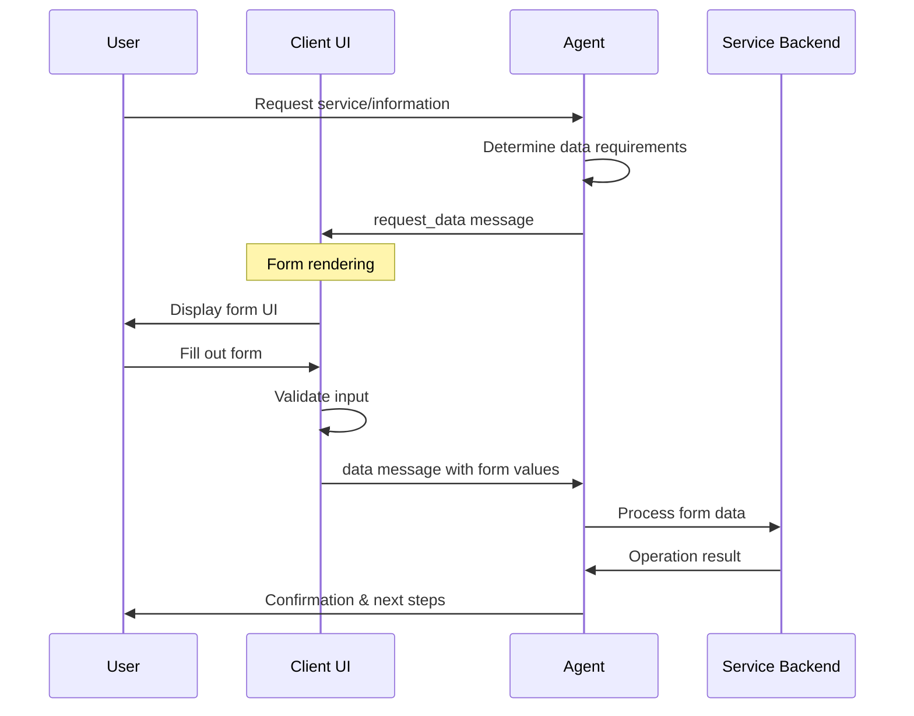

# AITP-03: Data Request Implementation Guide

:::note Auto-generated Documentation
Parts of this documentation were auto-generated from the schema and example messages by an AI model.
:::

This guide provides practical implementation details for developers integrating the AITP-03 Data Request capability into agents and user interfaces.



## Implementation for Agent Developers

### When to Use the Data Request Capability

Use the Data Request capability when your agent needs to:

1. Collect structured information that follows a form-like pattern
2. Validate input according to specific types (email, phone number, etc.)
3. Gather multiple related data points at once
4. Provide a consistent user experience for data entry

Common scenarios include:
- Collecting shipping or contact information
- Gathering user preferences
- Setting up account details
- Capturing specific structured details for a task

### Request Data Generation

```javascript
// Example JavaScript for generating a request_data message
function createDataRequest(options) {
  return {
    "$schema": "https://aitp.dev/capabilities/aitp-03-data-request/v1.0.0/schema.json",
    "request_data": {
      "id": generateUniqueId(), // Use UUID or similar
      "title": options.title || "",
      "description": options.description || "",
      "fillButtonLabel": options.buttonLabel || "Fill out form",
      "form": {
        "fields": options.fields.map(field => ({
          "id": field.id,
          "label": field.label,
          "description": field.description || "",
          "default_value": field.defaultValue || "",
          "type": field.type || "text",
          "options": field.options || [],
          "required": field.required || false,
          "autocomplete": field.autocomplete || ""
        }))
      }
    }
  };
}

// Alternative version using an external JSON definition
function createExternalDataRequest(options) {
  return {
    "$schema": "https://aitp.dev/capabilities/aitp-03-data-request/v1.0.0/schema.json",
    "request_data": {
      "id": generateUniqueId(),
      "title": options.title || "",
      "description": options.description || "",
      "fillButtonLabel": options.buttonLabel || "Fill out form",
      "form": {
        "json_url": options.formUrl
      }
    }
  };
}
```

### Processing Data Responses

```javascript
// Example JavaScript for handling a data response
function handleDataResponse(dataResponse) {
  // Find the original request
  const requestId = dataResponse.data.request_data_id;
  const originalRequest = findRequestById(requestId);
  
  // Process submitted field values
  const formData = {};
  dataResponse.data.fields.forEach(field => {
    formData[field.id] = field.value;
    
    // Special handling for different field types
    if (originalRequest) {
      const fieldDef = originalRequest.request_data.form.fields.find(f => f.id === field.id);
      if (fieldDef && fieldDef.type === "number") {
        formData[field.id] = parseFloat(field.value);
      }
    }
  });
  
  return formData;
}
```

## Encryption with ECIES-secp256k1

For sensitive data, AITP supports field-level encryption using ECIES (Elliptic Curve Integrated Encryption Scheme) with the secp256k1 curve, the same cryptographic curve used in Bitcoin and many other cryptocurrencies.

### Security Considerations

When using encryption:
- Use a fresh ephemeral key pair for each field encryption
- Never reuse ephemeral keys across different fields or messages
- Always verify the MAC before trusting decrypted data
- Validate public keys before using them for encryption

### TypeScript Implementation Example (using eciesjs)

The AITP protocol specifies a standard format for encrypted data using ECIES with secp256k1. This ensures interoperability between different implementations.

```typescript
import { PrivateKey, encrypt, decrypt } from 'eciesjs';

// Function to encrypt a field value
function encryptFieldValue(value: string, recipientPublicKeyHex: string): any {
  // Convert value to buffer
  const valueBuffer = Buffer.from(value, 'utf8');
  
  // Encrypt the value using ECIES
  const encryptedData = encrypt(recipientPublicKeyHex, valueBuffer);
  
  // In eciesjs, the format is:
  // [ ephemeral public key (65 bytes) | nonce (16 bytes) | tag/MAC (16 bytes) | encrypted data ]
  const ephemeralPublicKey = encryptedData.slice(0, 65).toString('hex');
  const nonce = encryptedData.slice(65, 65 + 16).toString('hex');
  const tag = encryptedData.slice(65 + 16, 65 + 16 + 16).toString('hex');
  const ciphertext = encryptedData.slice(65 + 16 + 16).toString('hex');
  
  // Return encrypted field in AITP format
  return {
    value: ciphertext,
    encryption: {
      algorithm: 'ECIES-secp256k1-AES-256-GCM',
      publicKey: recipientPublicKeyHex,
      ephemeralPublicKey: ephemeralPublicKey,
      mac: tag,
      iv: nonce
    }
  };
}

// Function to decrypt a field value
function decryptFieldValue(encryptedField: any, privateKeyHex: string): string {
  const { value, encryption } = encryptedField;
  
  // The AITP format separates the components, but eciesjs expects:
  // [ ephemeral public key | nonce | tag/MAC | encrypted data ]
  const { ephemeralPublicKey, mac, iv } = encryption;
  
  // Reconstruct the eciesjs format
  const encryptedBuffer = Buffer.concat([
    Buffer.from(ephemeralPublicKey, 'hex'),
    Buffer.from(iv, 'hex'),
    Buffer.from(mac, 'hex'),
    Buffer.from(value, 'hex')
  ]);
  
  // Decrypt using eciesjs
  const decryptedBuffer = decrypt(privateKeyHex, encryptedBuffer);
  
  // Return as string
  return decryptedBuffer.toString('utf8');
}

// Example usage
function exampleEncryptDecrypt() {
  // Generate a keypair for the agent
  const agentPrivateKey = new PrivateKey();
  const agentPublicKeyHex = agentPrivateKey.publicKey.toHex();
  const agentPrivateKeyHex = agentPrivateKey.toHex();
  
  // Create a data request with encryption enabled
  const dataRequest = {
    $schema: "https://aitp.dev/capabilities/aitp-03-data-request/v1.0.0/schema.json",
    request_data: {
      id: "payment-info-request",
      title: "Payment Information",
      description: "Please provide your payment details to complete your order",
      form: {
        fields: [
          {
            id: "credit_card",
            label: "Credit Card Number",
            type: "text",
            required: true,
            encryption: {
              algorithm: "ECIES-secp256k1-AES-256-GCM",
              publicKey: agentPublicKeyHex
            }
          }
        ]
      }
    }
  };
  
  console.log("Data Request:", JSON.stringify(dataRequest, null, 2));
  
  // Client encrypts the sensitive data
  const creditCardNumber = "4111111111111111";
  const encryptedField = encryptFieldValue(creditCardNumber, agentPublicKeyHex);
  
  // Create a response with the encrypted field
  const dataResponse = {
    $schema: "https://aitp.dev/capabilities/aitp-03-data-request/v1.0.0/schema.json",
    data: {
      request_data_id: "payment-info-request",
      fields: [
        {
          id: "credit_card",
          label: "Credit Card Number",
          ...encryptedField
        }
      ]
    }
  };
  
  console.log("Encrypted Response:", JSON.stringify(dataResponse, null, 2));
  
  // Agent decrypts the data
  const decryptedValue = decryptFieldValue(
    dataResponse.data.fields[0],
    agentPrivateKeyHex
  );
  
  console.log("Decrypted Credit Card:", decryptedValue);
  console.assert(decryptedValue === creditCardNumber, "Decryption failed!");
}
```

## Implementation for UI Developers

### Rendering Form Fields

```jsx
// React example for rendering a form from request_data
function DataRequestForm({ request, onSubmit }) {
  const [formValues, setFormValues] = useState({});
  const [errors, setErrors] = useState({});
  
  // Initialize with default values
  useEffect(() => {
    const defaults = {};
    request.request_data.form.fields.forEach(field => {
      if (field.default_value) {
        defaults[field.id] = field.default_value;
      }
    });
    setFormValues(defaults);
  }, [request]);
  
  const handleChange = (id, value) => {
    setFormValues(prev => ({
      ...prev,
      [id]: value
    }));
    
    // Clear error when field is updated
    if (errors[id]) {
      setErrors(prev => {
        const newErrors = {...prev};
        delete newErrors[id];
        return newErrors;
      });
    }
  };
  
  const validateForm = () => {
    const newErrors = {};
    request.request_data.form.fields.forEach(field => {
      if (field.required && (!formValues[field.id] || formValues[field.id].trim() === '')) {
        newErrors[field.id] = 'This field is required';
      } else if (field.type === 'email' && formValues[field.id]) {
        // Basic email validation
        const emailRegex = /^[^\s@]+@[^\s@]+\.[^\s@]+$/;
        if (!emailRegex.test(formValues[field.id])) {
          newErrors[field.id] = 'Please enter a valid email address';
        }
      }
    });
    setErrors(newErrors);
    return Object.keys(newErrors).length === 0;
  };
  
  const handleSubmit = () => {
    if (validateForm()) {
      // Convert values to AITP data response format
      const fields = request.request_data.form.fields.map(field => ({
        id: field.id,
        label: field.label,
        value: formValues[field.id] || ''
      }));
      
      onSubmit({
        "$schema": "https://aitp.dev/capabilities/aitp-03-data-request/v1.0.0/schema.json",
        "data": {
          "request_data_id": request.request_data.id,
          "fields": fields
        }
      });
    }
  };
  
  return (
    <div className="data-request-form">
      <h3>{request.request_data.title}</h3>
      <p>{request.request_data.description}</p>
      
      <div className="form-fields">
        {request.request_data.form.fields.map(field => (
          <div key={field.id} className="form-field">
            <label htmlFor={field.id}>
              {field.label}
              {field.required && <span className="required">*</span>}
            </label>
            
            {field.description && (
              <p className="field-description">{field.description}</p>
            )}
            
            {renderField(field, formValues[field.id], value => handleChange(field.id, value))}
            
            {errors[field.id] && (
              <div className="error-message">{errors[field.id]}</div>
            )}
          </div>
        ))}
      </div>
      
      <button 
        className="submit-button"
        onClick={handleSubmit}
      >
        {request.request_data.fillButtonLabel || "Submit"}
      </button>
    </div>
  );
}

// Helper function to render different field types
function renderField(field, value, onChange) {
  const commonProps = {
    id: field.id,
    value: value || '',
    onChange: e => onChange(e.target.value),
    required: field.required,
    autoComplete: field.autocomplete || 'off'
  };
  
  switch (field.type) {
    case 'textarea':
      return <textarea {...commonProps} rows={4} />;
      
    case 'select':
      return (
        <select {...commonProps}>
          <option value="">-- Select --</option>
          {field.options.map(option => (
            <option key={option} value={option}>{option}</option>
          ))}
        </select>
      );
      
    case 'combobox':
      // Basic combobox implementation
      return (
        <div className="combobox">
          <input 
            {...commonProps}
            list={`datalist-${field.id}`}
            type="text"
          />
          <datalist id={`datalist-${field.id}`}>
            {field.options.map(option => (
              <option key={option} value={option} />
            ))}
          </datalist>
        </div>
      );
      
    case 'number':
      return <input {...commonProps} type="number" />;
      
    case 'email':
      return <input {...commonProps} type="email" />;
      
    case 'tel':
      return <input {...commonProps} type="tel" />;
      
    case 'text':
    default:
      return <input {...commonProps} type="text" />;
  }
}
```

### Handling External Form Definitions

```jsx
function ExternalDataRequestForm({ request, onSubmit }) {
  const [formDefinition, setFormDefinition] = useState(null);
  const [loading, setLoading] = useState(true);
  const [error, setError] = useState(null);
  
  useEffect(() => {
    if (request.request_data.form.json_url) {
      setLoading(true);
      fetch(request.request_data.form.json_url)
        .then(response => {
          if (!response.ok) {
            throw new Error('Failed to load form definition');
          }
          return response.json();
        })
        .then(data => {
          setFormDefinition(data);
          setLoading(false);
        })
        .catch(err => {
          setError(err.message);
          setLoading(false);
        });
    }
  }, [request]);
  
  if (loading) {
    return <div className="loading">Loading form...</div>;
  }
  
  if (error) {
    return <div className="error">Error loading form: {error}</div>;
  }
  
  if (!formDefinition) {
    return <div className="error">No form definition found</div>;
  }
  
  // Create a modified request with the loaded form definition
  const modifiedRequest = {
    ...request,
    request_data: {
      ...request.request_data,
      form: formDefinition
    }
  };
  
  return <DataRequestForm request={modifiedRequest} onSubmit={onSubmit} />;
}
```
