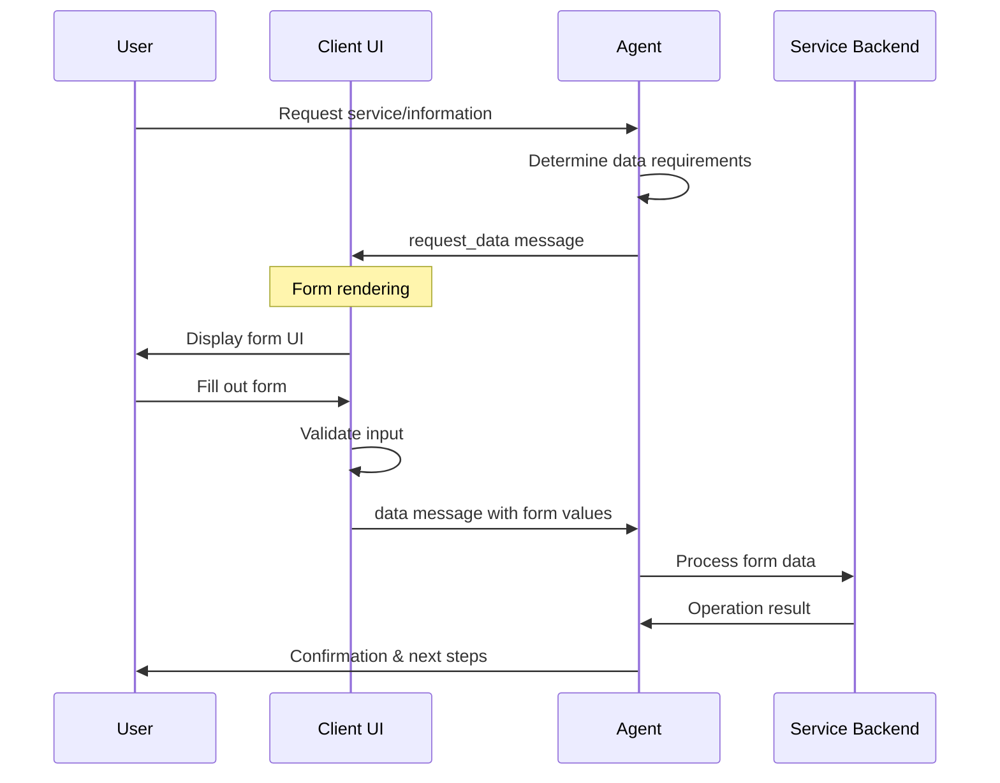
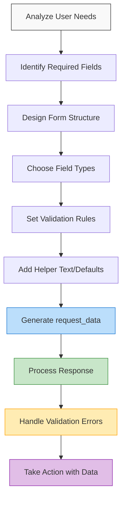

# AITP-03: Data Request Implementation Guide

* Spec Status: Draft
* Implementation Status: Live on NEAR AI

:::note Auto-generated Documentation
This documentation was auto-generated from the schema and examples by an AI model.
:::

This guide provides practical implementation details for developers integrating the AITP-03 Data Request capability into agents and user interfaces.



## Implementation for Agent Developers

### When to Use the Data Request Capability

Use the Data Request capability when your agent needs to:

1. Collect structured information that follows a form-like pattern
2. Validate input according to specific types (email, phone number, etc.)
3. Gather multiple related data points at once
4. Provide a consistent user experience for data entry

Common scenarios include:
- Collecting shipping or contact information
- Gathering user preferences
- Setting up account details
- Capturing specific structured details for a task

### Request Data Generation

```javascript
// Example JavaScript for generating a request_data message
function createDataRequest(options) {
  return {
    "$schema": "https://aitp.dev/v1/data/schema.json",
    "request_data": {
      "id": generateUniqueId(), // Use UUID or similar
      "title": options.title || "",
      "description": options.description || "",
      "fillButtonLabel": options.buttonLabel || "Fill out form",
      "form": {
        "fields": options.fields.map(field => ({
          "id": field.id,
          "label": field.label,
          "description": field.description || "",
          "default_value": field.defaultValue || "",
          "type": field.type || "text",
          "options": field.options || [],
          "required": field.required || false,
          "autocomplete": field.autocomplete || ""
        }))
      }
    }
  };
}

// Alternative version using an external JSON definition
function createExternalDataRequest(options) {
  return {
    "$schema": "https://aitp.dev/v1/data/schema.json",
    "request_data": {
      "id": generateUniqueId(),
      "title": options.title || "",
      "description": options.description || "",
      "fillButtonLabel": options.buttonLabel || "Fill out form",
      "form": {
        "json_url": options.formUrl
      }
    }
  };
}
```

### Processing Data Responses

```javascript
// Example JavaScript for handling a data response
function handleDataResponse(dataResponse) {
  // Find the original request
  const requestId = dataResponse.data.request_data_id;
  const originalRequest = findRequestById(requestId);
  
  // Process submitted field values
  const formData = {};
  dataResponse.data.fields.forEach(field => {
    formData[field.id] = field.value;
    
    // Special handling for different field types
    if (originalRequest) {
      const fieldDef = originalRequest.request_data.form.fields.find(f => f.id === field.id);
      if (fieldDef && fieldDef.type === "number") {
        formData[field.id] = parseFloat(field.value);
      }
    }
  });
  
  return formData;
}
```

### Best Practices for Agent Developers




1. **Minimize Form Fields**: 
   - Only ask for information that's truly necessary
   - Group related information in a single form
   - Use progressive disclosure - ask for basic info first, then more specific details later

2. **Clear Labeling and Instructions**:
   - Provide descriptive labels for all fields
   - Include helper text to explain unclear fields
   - Use the form description to explain why you need this information

3. **Appropriate Field Types**:
   - Use specialized field types like `email`, `tel`, and `number` to enable validation and appropriate input methods
   - Use `select` for fixed options to avoid free-form text errors
   - Use `combobox` when you want to suggest options but allow custom entries

4. **Smart Defaults and Autocomplete**:
   - Provide sensible default values when possible
   - Use autocomplete attributes to help users fill forms more easily
   - Pre-fill information you already know

5. **Field Validation**:
   - Mark fields as required only when truly necessary
   - Be prepared to handle missing or invalid responses
   - Have fallback behaviors if data isn't provided

6. **External Form Definitions**:
   - Consider using `json_url` for complex or frequently changing forms
   - This allows updating form structure without changing agent code
   - Be prepared to handle failed fetches of external form definitions

## Implementation for UI Developers

### Rendering Form Fields

```mermaid
graph TD
    subgraph "Field Types"
    
    subgraph "Text"
        Text[Text Input] --> TextExample["First Name: [John       ]"]
    end
    
    subgraph "Number"
        Number[Number Input] --> NumberExample["Age: [42  ▲<br>      ▼]"]
    end
    
    subgraph "Email"
        Email[Email Input] --> EmailExample["Email: [user@example.com]"]
    end
    
    subgraph "Textarea"
        Textarea[Multiline Input] --> TextareaExample["Comments:<br>[This is a comment that<br>spans multiple lines in<br>a text area.           ]"]
    end
    
    subgraph "Select"
        Select[Dropdown Select] --> SelectExample["Country: [United States ▼]"]
    end
    
    subgraph "Combobox"
        Combobox[Combobox] --> ComboboxExample["Color: [Custom Blue   ▼]<br>┌─────────────┐<br>│Red          │<br>│Green        │<br>│Blue         │<br>└─────────────┘"]
    end
    
    subgraph "Tel"
        Tel[Phone Input] --> TelExample["Phone: [(555) 123-4567]"]
    end
    
    end
    
    style Text fill:#e3f2fd,stroke:#1976d2
    style Number fill:#e8f5e9,stroke:#388e3c
    style Email fill:#fff3e0,stroke:#e65100
    style Textarea fill:#f3e5f5,stroke:#7b1fa2
    style Select fill:#e0f7fa,stroke:#00838f
    style Combobox fill:#fff8e1,stroke:#ff8f00
    style Tel fill:#f1f8e9,stroke:#558b2f
```

```jsx
// React example for rendering a form from request_data
function DataRequestForm({ request, onSubmit }) {
  const [formValues, setFormValues] = useState({});
  const [errors, setErrors] = useState({});
  
  // Initialize with default values
  useEffect(() => {
    const defaults = {};
    request.request_data.form.fields.forEach(field => {
      if (field.default_value) {
        defaults[field.id] = field.default_value;
      }
    });
    setFormValues(defaults);
  }, [request]);
  
  const handleChange = (id, value) => {
    setFormValues(prev => ({
      ...prev,
      [id]: value
    }));
    
    // Clear error when field is updated
    if (errors[id]) {
      setErrors(prev => {
        const newErrors = {...prev};
        delete newErrors[id];
        return newErrors;
      });
    }
  };
  
  const validateForm = () => {
    const newErrors = {};
    request.request_data.form.fields.forEach(field => {
      if (field.required && (!formValues[field.id] || formValues[field.id].trim() === '')) {
        newErrors[field.id] = 'This field is required';
      } else if (field.type === 'email' && formValues[field.id]) {
        // Basic email validation
        const emailRegex = /^[^\s@]+@[^\s@]+\.[^\s@]+$/;
        if (!emailRegex.test(formValues[field.id])) {
          newErrors[field.id] = 'Please enter a valid email address';
        }
      }
    });
    setErrors(newErrors);
    return Object.keys(newErrors).length === 0;
  };
  
  const handleSubmit = () => {
    if (validateForm()) {
      // Convert values to AITP data response format
      const fields = request.request_data.form.fields.map(field => ({
        id: field.id,
        label: field.label,
        value: formValues[field.id] || ''
      }));
      
      onSubmit({
        "$schema": "https://aitp.dev/v1/data/schema.json",
        "data": {
          "request_data_id": request.request_data.id,
          "fields": fields
        }
      });
    }
  };
  
  return (
    <div className="data-request-form">
      <h3>{request.request_data.title}</h3>
      <p>{request.request_data.description}</p>
      
      <div className="form-fields">
        {request.request_data.form.fields.map(field => (
          <div key={field.id} className="form-field">
            <label htmlFor={field.id}>
              {field.label}
              {field.required && <span className="required">*</span>}
            </label>
            
            {field.description && (
              <p className="field-description">{field.description}</p>
            )}
            
            {renderField(field, formValues[field.id], value => handleChange(field.id, value))}
            
            {errors[field.id] && (
              <div className="error-message">{errors[field.id]}</div>
            )}
          </div>
        ))}
      </div>
      
      <button 
        className="submit-button"
        onClick={handleSubmit}
      >
        {request.request_data.fillButtonLabel || "Submit"}
      </button>
    </div>
  );
}

// Helper function to render different field types
function renderField(field, value, onChange) {
  const commonProps = {
    id: field.id,
    value: value || '',
    onChange: e => onChange(e.target.value),
    required: field.required,
    autoComplete: field.autocomplete || 'off'
  };
  
  switch (field.type) {
    case 'textarea':
      return <textarea {...commonProps} rows={4} />;
      
    case 'select':
      return (
        <select {...commonProps}>
          <option value="">-- Select --</option>
          {field.options.map(option => (
            <option key={option} value={option}>{option}</option>
          ))}
        </select>
      );
      
    case 'combobox':
      // Basic combobox implementation
      return (
        <div className="combobox">
          <input 
            {...commonProps}
            list={`datalist-${field.id}`}
            type="text"
          />
          <datalist id={`datalist-${field.id}`}>
            {field.options.map(option => (
              <option key={option} value={option} />
            ))}
          </datalist>
        </div>
      );
      
    case 'number':
      return <input {...commonProps} type="number" />;
      
    case 'email':
      return <input {...commonProps} type="email" />;
      
    case 'tel':
      return <input {...commonProps} type="tel" />;
      
    case 'text':
    default:
      return <input {...commonProps} type="text" />;
  }
}
```

### Handling External Form Definitions

```jsx
function ExternalDataRequestForm({ request, onSubmit }) {
  const [formDefinition, setFormDefinition] = useState(null);
  const [loading, setLoading] = useState(true);
  const [error, setError] = useState(null);
  
  useEffect(() => {
    if (request.request_data.form.json_url) {
      setLoading(true);
      fetch(request.request_data.form.json_url)
        .then(response => {
          if (!response.ok) {
            throw new Error('Failed to load form definition');
          }
          return response.json();
        })
        .then(data => {
          setFormDefinition(data);
          setLoading(false);
        })
        .catch(err => {
          setError(err.message);
          setLoading(false);
        });
    }
  }, [request]);
  
  if (loading) {
    return <div className="loading">Loading form...</div>;
  }
  
  if (error) {
    return <div className="error">Error loading form: {error}</div>;
  }
  
  if (!formDefinition) {
    return <div className="error">No form definition found</div>;
  }
  
  // Create a modified request with the loaded form definition
  const modifiedRequest = {
    ...request,
    request_data: {
      ...request.request_data,
      form: formDefinition
    }
  };
  
  return <DataRequestForm request={modifiedRequest} onSubmit={onSubmit} />;
}
```

## Best Practices for UI Developers

1. **Responsive Design**:
   - Ensure forms render well on mobile and desktop
   - Use appropriate input sizes for different field types
   - Consider breaking very long forms into steps or sections

2. **Accessibility**:
   - Use semantic HTML for form elements
   - Ensure proper label associations with form controls
   - Support keyboard navigation
   - Use ARIA attributes when needed
   - Test with screen readers

3. **Client-side Validation**:
   - Validate as users type for immediate feedback
   - Show clear error messages
   - Don't clear user input on validation errors
   - Provide hints for correct format (especially for tel, email)

4. **User Experience**:
   - Use appropriate keyboard types on mobile
   - Enable autofill where appropriate
   - Show progress for multi-step forms
   - Consider using field masking for formatted inputs (phone numbers, etc.)
   - Provide a way to cancel or reset the form

5. **Error Handling**:
   - Handle network errors for external form definitions
   - Provide retry options
   - Keep users informed about submission status
   - Cache partial form data to prevent loss

## Testing

When testing AITP-03 Data Request implementation:

1. Test all field types with valid and invalid data
2. Verify required field validation
3. Test with missing fields and unexpected input
4. Verify response format matches the schema exactly
5. Test form rendering on different devices and screen sizes
6. Test external form definitions with successful and failed fetches

## Security Considerations

1. Sanitize all content from request_data before rendering
2. Validate data responses on both client and server sides
3. Be cautious with autocomplete values - don't suggest credentials or sensitive data
4. Implement CSRF protection for form submissions
5. Consider adding rate limiting for form submissions

## Performance Considerations

1. Minimize form redraws during user interaction
2. Consider lazy loading external form definitions
3. Optimize form submission payload size
4. Implement optimistic UI updates after submission
5. Cache external form definitions when appropriate