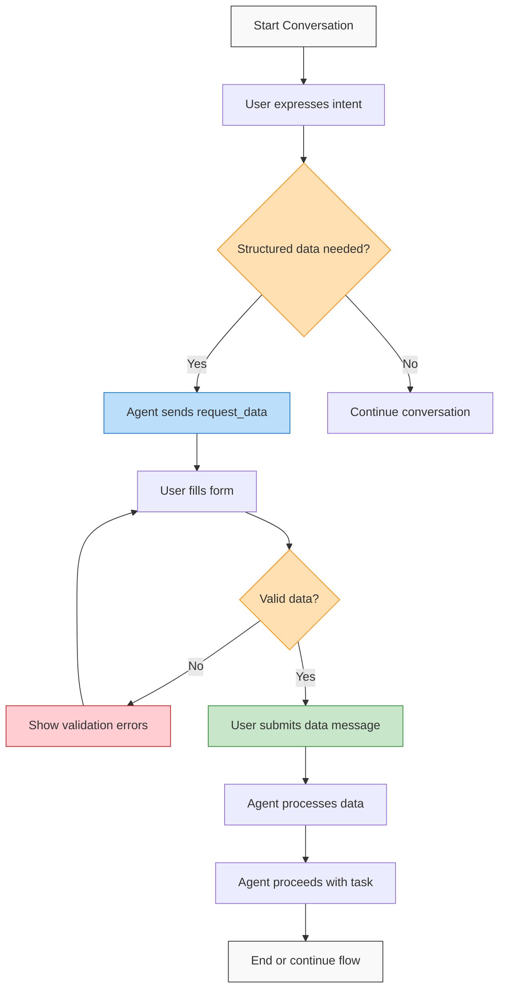
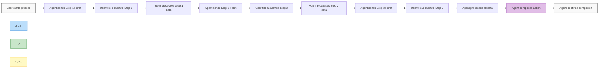

# AITP-03: Sample Data Request Flows

:::note Auto-generated Documentation
Parts of this documentation were auto-generated from the schema and example messages by an AI model.
:::

This document provides examples of common data request flows using the AITP-03 Data Request capability.



## User Profile Collection Flow

This flow demonstrates how an agent can collect user profile information.

### Step 1: User initiates conversation

```
User: I'd like to set up my profile.
```

### Step 2: Agent sends a data request for profile information

```json
{
  "$schema": "https://aitp.dev/capabilities/aitp-03-data-request/v1.0.0/schema.json",
  "request_data": {
    "id": "profile-setup",
    "title": "Profile Information",
    "description": "Please provide some basic information to set up your profile.",
    "fillButtonLabel": "Save Profile",
    "form": {
      "fields": [
        {
          "id": "full_name",
          "label": "Full Name",
          "description": "Your full name as you'd like it to appear",
          "type": "text",
          "required": true,
          "autocomplete": "name"
        },
        {
          "id": "email",
          "label": "Email Address",
          "description": "Your preferred contact email",
          "type": "email",
          "required": true,
          "autocomplete": "email"
        },
        {
          "id": "phone",
          "label": "Phone Number",
          "description": "Your contact phone number",
          "type": "tel",
          "required": false,
          "autocomplete": "tel"
        },
        {
          "id": "bio",
          "label": "Short Bio",
          "description": "Tell us a bit about yourself",
          "type": "textarea",
          "required": false
        }
      ]
    }
  }
}
```

### Step 3: User fills out and submits the form

```json
{
  "$schema": "https://aitp.dev/capabilities/aitp-03-data-request/v1.0.0/schema.json",
  "data": {
    "request_data_id": "profile-setup",
    "fields": [
      {
        "id": "full_name",
        "label": "Full Name",
        "value": "Jane Smith"
      },
      {
        "id": "email",
        "label": "Email Address",
        "value": "jane.smith@example.com"
      },
      {
        "id": "phone",
        "label": "Phone Number",
        "value": "+1 555-123-4567"
      },
      {
        "id": "bio",
        "label": "Short Bio",
        "value": "Software engineer with 10 years of experience. I enjoy hiking and photography in my free time."
      }
    ]
  }
}
```

### Step 4: Agent confirms profile creation

```
Agent: Thanks, Jane! Your profile has been set up successfully. Your contact email is jane.smith@example.com and phone number is +1 555-123-4567. You can update this information anytime.
```

## Shipping Address Collection Flow

This flow demonstrates collecting shipping information for an e-commerce transaction.

### Step 1: User is ready to complete a purchase

```
User: I'd like to checkout and complete my purchase.
```

### Step 2: Agent sends a data request for shipping information using an external form definition

```json
{
  "$schema": "https://aitp.dev/capabilities/aitp-03-data-request/v1.0.0/schema.json",
  "request_data": {
    "id": "shipping-info",
    "title": "Shipping Information",
    "description": "Please provide your shipping address for this order.",
    "fillButtonLabel": "Continue to Payment",
    "form": {
      "json_url": "https://app.near.ai/api/v1/aitp/data/forms/shipping_address_international.json"
    }
  }
}
```

### Step 3: Client fetches the external form definition

The client fetches the form from the URL, which contains:

```json
{
  "fields": [
    {
      "id": "recipient_name",
      "label": "Recipient Name",
      "type": "text",
      "required": true,
      "autocomplete": "name"
    },
    {
      "id": "address_line1",
      "label": "Address Line 1",
      "type": "text",
      "required": true,
      "autocomplete": "address-line1"
    },
    {
      "id": "address_line2",
      "label": "Address Line 2",
      "type": "text",
      "required": false,
      "autocomplete": "address-line2"
    },
    {
      "id": "city",
      "label": "City",
      "type": "text",
      "required": true,
      "autocomplete": "address-level2"
    },
    {
      "id": "state",
      "label": "State/Province/Region",
      "type": "text",
      "required": true,
      "autocomplete": "address-level1"
    },
    {
      "id": "postal_code",
      "label": "Postal/ZIP Code",
      "type": "text",
      "required": true,
      "autocomplete": "postal-code"
    },
    {
      "id": "country",
      "label": "Country",
      "type": "select",
      "options": ["United States", "Canada", "United Kingdom", "Australia", "Germany", "France", "Japan", "Other"],
      "required": true,
      "autocomplete": "country"
    },
    {
      "id": "special_instructions",
      "label": "Delivery Instructions",
      "description": "Any special instructions for the delivery person",
      "type": "textarea",
      "required": false
    }
  ]
}
```

### Step 4: User fills out and submits the form

```json
{
  "$schema": "https://aitp.dev/capabilities/aitp-03-data-request/v1.0.0/schema.json",
  "data": {
    "request_data_id": "shipping-info",
    "fields": [
      {
        "id": "recipient_name",
        "label": "Recipient Name",
        "value": "John Doe"
      },
      {
        "id": "address_line1",
        "label": "Address Line 1",
        "value": "123 Main Street"
      },
      {
        "id": "address_line2",
        "label": "Address Line 2",
        "value": "Apt 4B"
      },
      {
        "id": "city",
        "label": "City",
        "value": "New York"
      },
      {
        "id": "state",
        "label": "State/Province/Region",
        "value": "NY"
      },
      {
        "id": "postal_code",
        "label": "Postal/ZIP Code",
        "value": "10001"
      },
      {
        "id": "country",
        "label": "Country",
        "value": "United States"
      },
      {
        "id": "special_instructions",
        "label": "Delivery Instructions",
        "value": "Please leave the package with the doorman if I'm not home."
      }
    ]
  }
}
```

### Step 5: Agent confirms and continues to next step

```
Agent: Thanks, John. Your order will be shipped to:

John Doe
123 Main Street, Apt 4B
New York, NY 10001
United States

Special instructions: Please leave the package with the doorman if I'm not home.

Let's continue to payment details...
```

## Preference Collection Flow

This flow demonstrates collecting user preferences using a form with different field types.

### Step 1: User wants to personalize their experience

```
User: I'd like to set my preferences for product recommendations.
```

### Step 2: Agent sends a data request for preferences

```json
{
  "$schema": "https://aitp.dev/capabilities/aitp-03-data-request/v1.0.0/schema.json",
  "request_data": {
    "id": "user-preferences",
    "title": "Your Preferences",
    "description": "This information will help us provide more personalized recommendations for you.",
    "fillButtonLabel": "Save Preferences",
    "form": {
      "fields": [
        {
          "id": "favorite_color",
          "label": "Favorite Color",
          "description": "Choose your favorite color or enter a custom one",
          "type": "combobox",
          "options": ["Red", "Blue", "Green", "Purple", "Black", "White"],
          "default_value": "Blue",
          "required": false
        },
        {
          "id": "size_preference",
          "label": "Size Preference",
          "type": "select",
          "options": ["Small", "Medium", "Large", "X-Large"],
          "default_value": "Medium",
          "required": true
        },
        {
          "id": "price_range",
          "label": "Preferred Price Range",
          "type": "select",
          "options": ["Under $50", "$50-$100", "$100-$200", "Over $200", "No Preference"],
          "default_value": "No Preference",
          "required": true
        },
        {
          "id": "notifications_enabled",
          "label": "Email Notifications",
          "description": "Would you like to receive email notifications about new products?",
          "type": "select",
          "options": ["Yes", "No"],
          "default_value": "Yes",
          "required": true
        }
      ]
    }
  }
}
```

### Step 3: User fills out and submits the form

```json
{
  "$schema": "https://aitp.dev/capabilities/aitp-03-data-request/v1.0.0/schema.json",
  "data": {
    "request_data_id": "user-preferences",
    "fields": [
      {
        "id": "favorite_color",
        "label": "Favorite Color",
        "value": "Teal"
      },
      {
        "id": "size_preference",
        "label": "Size Preference",
        "value": "Medium"
      },
      {
        "id": "price_range",
        "label": "Preferred Price Range",
        "value": "$50-$100"
      },
      {
        "id": "notifications_enabled",
        "label": "Email Notifications",
        "value": "Yes"
      }
    ]
  }
}
```

### Step 4: Agent confirms the preferences

```
Agent: Thanks for sharing your preferences! I've saved them and will use them to customize your experience:

- Your favorite color is Teal
- You prefer Medium-sized items
- Your preferred price range is $50-$100
- You've opted in to email notifications

You'll now see more personalized recommendations based on these preferences.
```

## Multi-page Form Flow

This flow demonstrates a multi-step form where data is collected in stages.



### Step 1: User initiates registration

```
User: I'd like to register for the conference.
```

### Step 2: Agent sends the first stage of registration

```json
{
  "$schema": "https://aitp.dev/capabilities/aitp-03-data-request/v1.0.0/schema.json",
  "request_data": {
    "id": "registration-step1",
    "title": "Personal Information",
    "description": "Please provide your personal information to begin the registration process. (Step 1 of 3)",
    "fillButtonLabel": "Continue to Step 2",
    "form": {
      "fields": [
        {
          "id": "full_name",
          "label": "Full Name",
          "type": "text",
          "required": true,
          "autocomplete": "name"
        },
        {
          "id": "email",
          "label": "Email Address",
          "type": "email",
          "required": true,
          "autocomplete": "email"
        },
        {
          "id": "job_title",
          "label": "Job Title",
          "type": "text",
          "required": true
        },
        {
          "id": "company",
          "label": "Company",
          "type": "text",
          "required": true
        }
      ]
    }
  }
}
```

### Step 3: User submits the first stage

```json
{
  "$schema": "https://aitp.dev/capabilities/aitp-03-data-request/v1.0.0/schema.json",
  "data": {
    "request_data_id": "registration-step1",
    "fields": [
      {
        "id": "full_name",
        "label": "Full Name",
        "value": "Sarah Johnson"
      },
      {
        "id": "email",
        "label": "Email Address",
        "value": "sarah.johnson@example.com"
      },
      {
        "id": "job_title",
        "label": "Job Title",
        "value": "Product Manager"
      },
      {
        "id": "company",
        "label": "Company",
        "value": "Acme Corp"
      }
    ]
  }
}
```

### Step 4: Agent sends the second stage of registration

```json
{
  "$schema": "https://aitp.dev/capabilities/aitp-03-data-request/v1.0.0/schema.json",
  "request_data": {
    "id": "registration-step2",
    "title": "Conference Details",
    "description": "Please select your conference preferences. (Step 2 of 3)",
    "fillButtonLabel": "Continue to Step 3",
    "form": {
      "fields": [
        {
          "id": "conference_track",
          "label": "Conference Track",
          "description": "Select the track that most interests you",
          "type": "select",
          "options": ["Business", "Technical", "Design", "Marketing"],
          "required": true
        },
        {
          "id": "dietary_restrictions",
          "label": "Dietary Restrictions",
          "type": "select",
          "options": ["None", "Vegetarian", "Vegan", "Gluten-Free", "Other"],
          "required": true
        },
        {
          "id": "dietary_notes",
          "label": "Dietary Notes",
          "description": "If you selected 'Other' above, please specify",
          "type": "textarea",
          "required": false
        }
      ]
    }
  }
}
```

### Step 5: User submits the second stage

```json
{
  "$schema": "https://aitp.dev/capabilities/aitp-03-data-request/v1.0.0/schema.json",
  "data": {
    "request_data_id": "registration-step2",
    "fields": [
      {
        "id": "conference_track",
        "label": "Conference Track",
        "value": "Technical"
      },
      {
        "id": "dietary_restrictions",
        "label": "Dietary Restrictions",
        "value": "Vegetarian"
      },
      {
        "id": "dietary_notes",
        "label": "Dietary Notes",
        "value": ""
      }
    ]
  }
}
```

### Step 6: Agent sends the final stage of registration

```json
{
  "$schema": "https://aitp.dev/capabilities/aitp-03-data-request/v1.0.0/schema.json",
  "request_data": {
    "id": "registration-step3",
    "title": "Payment Information",
    "description": "Please provide your payment details to complete registration. (Step 3 of 3)",
    "fillButtonLabel": "Complete Registration",
    "form": {
      "fields": [
        {
          "id": "payment_method",
          "label": "Payment Method",
          "type": "select",
          "options": ["Credit Card", "PayPal", "Invoice"],
          "required": true
        },
        {
          "id": "card_holder",
          "label": "Card Holder Name",
          "type": "text",
          "required": true,
          "autocomplete": "cc-name"
        },
        {
          "id": "card_number",
          "label": "Card Number",
          "type": "text",
          "required": true,
          "autocomplete": "cc-number"
        },
        {
          "id": "expiry_date",
          "label": "Expiration Date (MM/YY)",
          "type": "text",
          "required": true,
          "autocomplete": "cc-exp"
        },
        {
          "id": "cvv",
          "label": "Security Code (CVV)",
          "type": "text",
          "required": true,
          "autocomplete": "cc-csc"
        }
      ]
    }
  }
}
```

### Step 7: User submits the final stage

```json
{
  "$schema": "https://aitp.dev/capabilities/aitp-03-data-request/v1.0.0/schema.json",
  "data": {
    "request_data_id": "registration-step3",
    "fields": [
      {
        "id": "payment_method",
        "label": "Payment Method",
        "value": "Credit Card"
      },
      {
        "id": "card_holder",
        "label": "Card Holder Name",
        "value": "Sarah Johnson"
      },
      {
        "id": "card_number",
        "label": "Card Number",
        "value": "************1234"
      },
      {
        "id": "expiry_date",
        "label": "Expiration Date (MM/YY)",
        "value": "09/26"
      },
      {
        "id": "cvv",
        "label": "Security Code (CVV)",
        "value": "***"
      }
    ]
  }
}
```

### Step 8: Agent confirms complete registration

```
Agent: Thank you, Sarah! Your registration for the conference is now complete.

Registration Summary:
- Name: Sarah Johnson
- Email: sarah.johnson@example.com
- Company: Acme Corp
- Job Title: Product Manager
- Conference Track: Technical
- Dietary Preference: Vegetarian
- Payment Method: Credit Card (ending in 1234)

You will receive a confirmation email shortly with additional details. We look forward to seeing you at the conference!
```

## Best Practices from these Examples

1. **Progressive Disclosure**: Break complex forms into logical steps to avoid overwhelming users

2. **Clear Context**: Provide descriptive titles and explanations for form requests

3. **Field Validation**: Use appropriate field types to ensure correct data formats

4. **Smart Defaults**: Provide sensible default values when possible

5. **Autocomplete Support**: Include autocomplete attributes for common fields to speed up form completion

6. **Appropriate Field Types**: Match the field type to the expected data:
   - Use `select` for fixed options
   - Use `combobox` when you want suggestions but allow custom values
   - Use specialized types like `email` and `tel` for proper validation

7. **Confirmation**: Always confirm submitted data with the user

8. **Sensitive Data Handling**: For sensitive data like credit cards, accept the input but redact it in responses