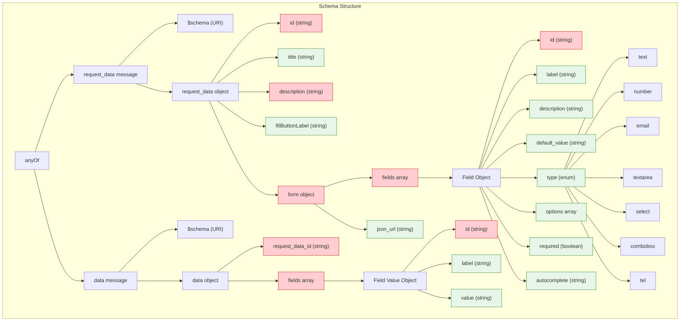

# AITP-03: Data Request Schema Reference

* Spec Status: Draft
* Implementation Status: Live on NEAR AI

:::note Auto-generated Documentation
This documentation was auto-generated from the schema and examples by an AI model.
:::

## Schema URL

```
https://aitp.dev/capabilities/aitp-03-data-request/v1.0.0/schema.json
```

## Schema Overview



The AITP-03 Data Request capability defines a JSON schema that supports two main message types:

1. **Request Data** - Asking the user or agent to fill out a form
2. **Data** - Responding with the filled form data

## Complete Schema Definition

The schema is structured as an "anyOf" with two possible object types.

### Request Data Schema

```json
{
  "type": "object",
  "properties": {
    "$schema": {
      "type": "string",
      "format": "uri"
    },
    "request_data": {
      "type": "object",
      "properties": {
        "id": {
          "type": "string"
        },
        "title": {
          "type": "string"
        },
        "description": {
          "type": "string"
        },
        "fillButtonLabel": {
          "type": "string",
          "default": "Fill out form"
        },
        "form": {
          "type": "object",
          "properties": {
            "fields": {
              "type": "array",
              "items": {
                "type": "object",
                "properties": {
                  "id": {
                    "type": "string"
                  },
                  "label": {
                    "type": "string"
                  },
                  "description": {
                    "type": "string"
                  },
                  "default_value": {
                    "type": "string"
                  },
                  "type": {
                    "type": "string",
                    "enum": [
                      "text",
                      "number",
                      "email",
                      "textarea",
                      "select",
                      "combobox",
                      "tel"
                    ],
                    "default": "text"
                  },
                  "options": {
                    "type": "array",
                    "items": {
                      "type": "string"
                    }
                  },
                  "required": {
                    "type": "boolean",
                    "default": false
                  },
                  "autocomplete": {
                    "type": "string"
                  }
                },
                "required": ["id"],
                "additionalProperties": true
              },
              "minItems": 1
            },
            "json_url": {
              "type": "string",
              "format": "uri"
            }
          },
          "additionalProperties": true
        }
      },
      "required": ["id", "description", "form"],
      "additionalProperties": true
    }
  },
  "required": ["$schema", "request_data"],
  "additionalProperties": true
}
```

### Data Response Schema

```json
{
  "type": "object",
  "properties": {
    "$schema": {
      "type": "string",
      "format": "uri"
    },
    "data": {
      "type": "object",
      "properties": {
        "request_data_id": {
          "type": "string"
        },
        "fields": {
          "type": "array",
          "items": {
            "type": "object",
            "properties": {
              "id": {
                "type": "string"
              },
              "label": {
                "type": "string"
              },
              "value": {
                "type": "string"
              }
            },
            "required": ["id"],
            "additionalProperties": true
          },
          "minItems": 1
        }
      },
      "required": ["fields"],
      "additionalProperties": true
    }
  },
  "required": ["$schema", "data"],
  "additionalProperties": true
}
```

## Field Descriptions

### Request Data Fields

| Field | Type | Required | Description |
|-------|------|----------|-------------|
| `$schema` | string | Yes | URI reference to the schema: `https://aitp.dev/capabilities/aitp-03-data-request/v1.0.0/schema.json` |
| `request_data` | object | Yes | Container for the data request |
| `request_data.id` | string | Yes | Unique identifier for this form request |
| `request_data.title` | string | No | Title for the form UI |
| `request_data.description` | string | Yes | Detailed explanation of what information is being requested |
| `request_data.fillButtonLabel` | string | No | Custom text for the submit button (defaults to "Fill out form") |
| `request_data.form` | object | Yes | Container for form definition |
| `request_data.form.fields` | array | No* | Array of field definitions (required if json_url is not provided) |
| `request_data.form.json_url` | string | No* | URL to external form definition (required if fields is not provided) |
| `request_data.form.fields[].id` | string | Yes | Unique identifier for this field |
| `request_data.form.fields[].label` | string | No | Display label for this field |
| `request_data.form.fields[].description` | string | No | Descriptive text or help text for this field |
| `request_data.form.fields[].default_value` | string | No | Default value for this field |
| `request_data.form.fields[].type` | string | No | Field input type (defaults to "text") |
| `request_data.form.fields[].options` | array | No | Array of options for select/combobox fields |
| `request_data.form.fields[].required` | boolean | No | Whether this field is required (defaults to false) |
| `request_data.form.fields[].autocomplete` | string | No | HTML autocomplete attribute value |

### Data Response Fields

| Field | Type | Required | Description |
|-------|------|----------|-------------|
| `$schema` | string | Yes | URI reference to the schema: `https://aitp.dev/capabilities/aitp-03-data-request/v1.0.0/schema.json` |
| `data` | object | Yes | Container for the response data |
| `data.request_data_id` | string | No | Reference to the ID of the request being responded to |
| `data.fields` | array | Yes | Array of field values |
| `data.fields[].id` | string | Yes | ID of the field (should match ID in the request) |
| `data.fields[].label` | string | No | Label of the field (for human readability) |
| `data.fields[].value` | string | No | Value provided for this field |

## Field Types

The `type` property of a field can be one of the following values:

| Type | Description | UI Representation |
|------|-------------|-------------------|
| `text` | Simple text input | Single-line text field |
| `number` | Numeric input | Number field with increment/decrement controls |
| `email` | Email address | Email field with format validation |
| `textarea` | Multi-line text | Text area for longer content |
| `select` | Selection from options | Dropdown select menu |
| `combobox` | Selection from options with custom input | Dropdown with text input |
| `tel` | Telephone number | Phone number input with format hints |

## Common Autocomplete Values

The `autocomplete` property can be set to the following values to help browsers auto-fill forms:

| Value | Description |
|-------|-------------|
| `name` | Full name |
| `given-name` | First name |
| `family-name` | Last name |
| `email` | Email address |
| `tel` | Telephone number |
| `street-address` | Street address |
| `address-line1` | Address line 1 |
| `address-line2` | Address line 2 |
| `address-level1` | State or province |
| `address-level2` | City |
| `postal-code` | Postal or ZIP code |
| `country` | Country |
| `cc-name` | Name on credit card |
| `cc-number` | Credit card number |
| `cc-exp` | Credit card expiration date |
| `cc-exp-month` | Credit card expiration month |
| `cc-exp-year` | Credit card expiration year |
| `cc-csc` | Credit card security code |
| `off` | Disable autocomplete |

## Validation Rules

Form fields should be validated according to these rules:

1. Fields marked as `required: true` must have a non-empty value
2. Fields with type `email` must contain a valid email format
3. Fields with type `number` should contain numeric values
4. Fields with type `tel` should contain a valid phone number format
5. Fields with type `select` should have a value from the provided options

## Schema Versioning

The schema URL includes a version number that follows semver:

```
https://aitp.dev/capabilities/aitp-03-data-request/v1.0.0/schema.json
```

Future versions will maintain backward compatibility within the same major version.