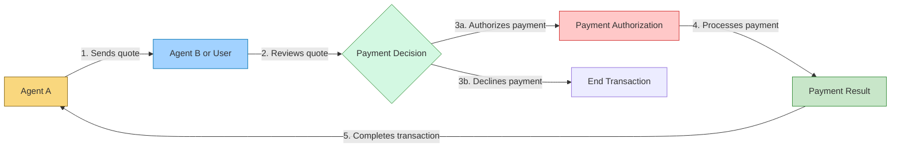
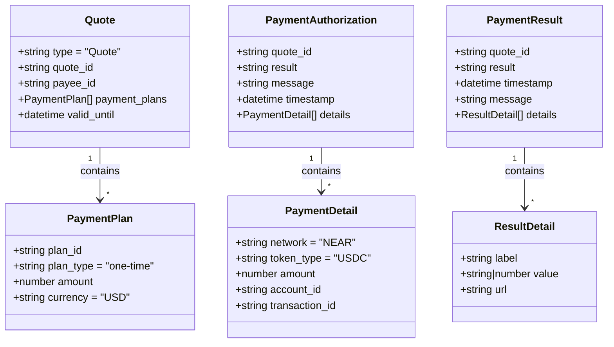

# AITP-04: Payments

* Spec Status: Draft
* Implementation Status: Live on NEAR AI

:::note Auto-generated Documentation
This documentation was auto-generated from the schema and examples by an AI model.
:::

## Overview



The Payments capability enables agents to request and process payments securely. This capability facilitates financial transactions between users and services, or between different agents, using standardized message formats to ensure consistency and security.

## Schema

Schema URL: `https://aitp.dev/capabilities/aitp-04-transactions/v1.0.0/schema.json`

The Payments capability defines three primary message types:
1. `quote` - Sent by an agent to request payment
2. `payment_authorization` - Sent by the payer to authorize a payment
3. `payment_result` - Sent by the payee to confirm payment processing

## Message Types



### Quote

A quote is sent by an agent (typically a service or merchant) to request payment from a user or another agent.

```json
{
  "$schema": "https://aitp.dev/capabilities/aitp-04-transactions/v1.0.0/schema.json",
  "quote": {
    "type": "Quote",
    "quote_id": "unique-quote-id",
    "payee_id": "merchant-identifier",
    "payment_plans": [
      {
        "plan_id": "plan-identifier",
        "plan_type": "one-time",
        "amount": 2.5,
        "currency": "USD"
      }
    ],
    "valid_until": "2025-01-01T00:00:00Z"
  }
}
```

#### Quote Fields:

- `type`: Always "Quote"
- `quote_id`: Unique identifier for this payment request
- `payee_id`: Identifier for the recipient of the payment
- `payment_plans`: Array of payment options
  - `plan_id`: Unique identifier for this payment plan
  - `plan_type`: Type of payment (currently only "one-time" is supported)
  - `amount`: Numeric amount to be paid
  - `currency`: Currency code (currently only "USD" is supported)
- `valid_until`: Expiration date/time for this quote

### Payment Authorization

A payment authorization is sent by the payer to approve the payment requested in a quote.

```json
{
  "$schema": "https://aitp.dev/capabilities/aitp-04-transactions/v1.0.0/schema.json",
  "payment_authorization": {
    "quote_id": "unique-quote-id",
    "result": "success",
    "message": "Payment authorized",
    "timestamp": "2023-01-01T12:34:56Z",
    "details": [
      {
        "network": "NEAR",
        "token_type": "USDC",
        "amount": 2.5,
        "account_id": "payer-account-id",
        "transaction_id": "blockchain-transaction-id"
      }
    ]
  }
}
```

#### Payment Authorization Fields:

- `quote_id`: Reference to the quote being authorized
- `result`: Result of the authorization attempt ("success" or "failure")
- `message`: Optional message describing the result
- `timestamp`: Date and time when the authorization was processed
- `details`: Array of payment details
  - `network`: Blockchain network (currently only "NEAR" is supported)
  - `token_type`: Token type used for payment (currently only "USDC" is supported)
  - `amount`: Amount that was authorized
  - `account_id`: Account identifier of the payer
  - `transaction_id`: Blockchain transaction identifier

### Payment Result

A payment result is sent by the payee to confirm the processing of a payment.

```json
{
  "$schema": "https://aitp.dev/capabilities/aitp-04-transactions/v1.0.0/schema.json",
  "payment_result": {
    "quote_id": "unique-quote-id",
    "result": "success",
    "timestamp": "2023-01-01T12:35:00Z",
    "message": "Payment processed successfully",
    "details": [
      {
        "label": "Order Number",
        "value": "ORD-12345",
        "url": "https://example.com/orders/12345"
      },
      {
        "label": "Estimated Delivery",
        "value": "January 5, 2023"
      }
    ]
  }
}
```

#### Payment Result Fields:

- `quote_id`: Reference to the quote that was paid
- `result`: Result of the payment processing ("success" or "failure")
- `timestamp`: Date and time when the payment was processed
- `message`: Optional message describing the result
- `details`: Array of additional details about the transaction
  - `label`: Label for the detail item
  - `value`: Value for the detail item (string or number)
  - `url`: Optional URL for more information

## Examples

### Basic Payment Flow

The following example demonstrates a complete payment flow:

1. Service agent sends a quote for a product:

```json
{
  "$schema": "https://aitp.dev/capabilities/aitp-04-transactions/v1.0.0/schema.json",
  "quote": {
    "type": "Quote",
    "quote_id": "quote_123",
    "payee_id": "merchant.near",
    "payment_plans": [
      {
        "plan_id": "plan_123",
        "plan_type": "one-time",
        "amount": 2.5,
        "currency": "USD"
      }
    ],
    "valid_until": "2050-01-01T00:00:00Z"
  }
}
```

2. User authorizes the payment:

```json
{
  "$schema": "https://aitp.dev/capabilities/aitp-04-transactions/v1.0.0/schema.json",
  "payment_authorization": {
    "quote_id": "quote_123",
    "result": "success",
    "timestamp": "2050-01-01T00:00:00Z",
    "details": [
      {
        "network": "NEAR",
        "token_type": "USDC",
        "amount": 2.5,
        "account_id": "customer.near",
        "transaction_id": "7vjj6uqQeyYciPNhA9jiRvfH98LVeJ7C8df4Q9rA3SfN"
      }
    ]
  }
}
```

3. Service agent confirms the payment:

```json
{
  "$schema": "https://aitp.dev/capabilities/aitp-04-transactions/v1.0.0/schema.json",
  "payment_result": {
    "quote_id": "quote_123",
    "result": "success",
    "timestamp": "2050-01-01T00:00:00Z",
    "message": "Your red socks are on their way!",
    "details": [
      {
        "label": "Order Number",
        "value": 123,
        "url": "https://near.ai"
      },
      {
        "label": "Product",
        "value": "Red Socks"
      }
    ]
  }
}
```

## Implementation Considerations

### For UIs and Client Applications

When implementing the Payments capability in a UI:

1. **Quote Display**:
   - Show clear pricing information
   - Display payment plan options clearly
   - Include expiration time for the quote
   - Show payee identification

2. **Payment Authorization**:
   - Request user confirmation before proceeding
   - Show transaction details before submission
   - Provide clear error handling for failed payments
   - Handle timeout and network issues gracefully

3. **Payment Result**:
   - Display confirmation messages clearly
   - Show relevant details (order number, tracking information, etc.)
   - Provide links to additional information when available

### For Agents

When implementing the Payments capability in an agent:

1. **Sending Quotes**:
   - Generate unique quote IDs
   - Set appropriate expiration times
   - Include all necessary payment details
   - Provide clear product or service descriptions

2. **Processing Authorizations**:
   - Verify the quote ID matches an active quote
   - Check that the authorization has not expired
   - Verify the payment details (amount, currency)
   - Handle both successful and failed authorizations

3. **Sending Results**:
   - Include all relevant order/transaction details
   - Provide meaningful confirmation messages
   - Include URLs for further tracking when possible

## Integration with Other Capabilities

The Payments capability works well with:

- **AITP-02: Decisions** - Use Decisions to offer product or service options before requesting payment
- **AITP-03: Data Request** - Collect shipping or billing information before processing payment
- **AITP-05: Signatures** - Add verification for high-value transactions

:::caution Security Considerations
- Always verify payment amounts match the original quote
- Implement idempotency to prevent double-charging
- Store transaction IDs securely for auditing
- Handle payment failures gracefully
- Ensure secure transmission of payment details
:::

## Limitations of Current Version

:::warning Current Limitations
- Only supports one-time payments (no subscriptions)
- Limited to USD currency
- Only supports NEAR blockchain with USDC tokens
- No support for traditional payment methods (credit cards, bank transfers)
:::

Future versions of the Payments capability may expand to include additional payment types, currencies, and networks.