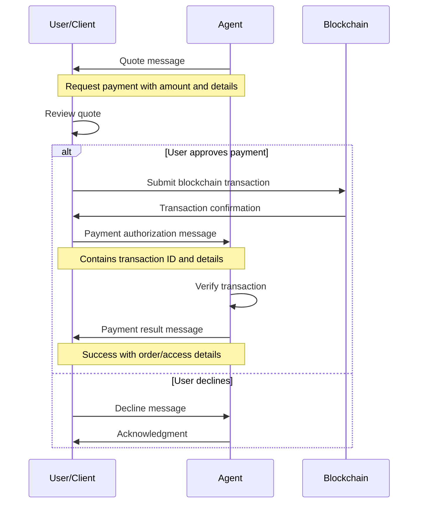

# AITP-04: Transactions Implementation Guide

:::note Auto-generated Documentation
Parts of this documentation were auto-generated from the schema and example messages by an AI model.
:::

This guide provides practical implementation details for developers integrating the AITP-04 Transactions capability into agents and user interfaces.



## Implementation for Agent Developers

### When to Use the Transactions Capability

Use the Transactions capability when your agent needs to:

1. Request payment for goods or services
2. Process payments from users
3. Confirm successful transactions
4. Provide receipt or order information after payment

Common scenarios include:
- E-commerce transactions
- Service subscriptions
- Digital content purchases
- Donations or tips

### Quote Generation

```javascript
// Example JavaScript for generating a quote message
function createQuote(options) {
  const currentTime = new Date();
  // Default expiration is 1 hour from now
  const expirationTime = new Date(currentTime.getTime() + 3600000);
  
  return {
    "$schema": "https://schema.aitp.dev/capabilities/aitp-04-transactions/v1.0.0/schema.json",
    "quote": {
      "type": "Quote",
      "quote_id": generateUniqueId(), // Use UUID or similar
      "payee_id": options.payeeId || "your-merchant-id.near",
      "payment_plans": [
        {
          "plan_id": `plan-${generateUniqueId()}`,
          "plan_type": "one-time",
          "amount": options.amount,
          "currency": "USD"
        }
      ],
      "valid_until": options.expirationTime || expirationTime.toISOString()
    }
  };
}
```

### Processing Payment Authorizations

```javascript
// Example JavaScript for handling a payment authorization
async function handlePaymentAuthorization(paymentAuth) {
  try {
    // Find the original quote
    const quoteId = paymentAuth.payment_authorization.quote_id;
    const originalQuote = await findQuoteById(quoteId);
    
    if (!originalQuote) {
      throw new Error("Quote not found");
    }
    
    // Check if quote is still valid
    const validUntil = new Date(originalQuote.quote.valid_until);
    if (validUntil < new Date()) {
      throw new Error("Quote has expired");
    }
    
    // Verify payment details
    const details = paymentAuth.payment_authorization.details[0];
    const expectedAmount = originalQuote.quote.payment_plans[0].amount;
    
    if (details.amount !== expectedAmount) {
      throw new Error("Payment amount mismatch");
    }
    
    // Verify transaction on blockchain
    const verificationResult = await verifyTransaction(
      details.network,
      details.transaction_id,
      details.account_id,
      details.token_type,
      details.amount
    );
    
    if (!verificationResult.success) {
      throw new Error("Transaction verification failed");
    }
    
    // Process the order or service
    const orderResult = await processOrder(quoteId, details);
    
    // Generate and send payment result
    return createPaymentResult(quoteId, "success", orderResult);
  } catch (error) {
    // Handle failures
    return createPaymentResult(quoteId, "failure", null, error.message);
  }
}
```

### Generating Payment Results

```javascript
// Example JavaScript for generating a payment result
function createPaymentResult(quoteId, result, orderDetails, errorMessage = null) {
  const details = [];
  
  if (orderDetails) {
    details.push({
      "label": "Order Number",
      "value": orderDetails.orderNumber,
      "url": `https://your-service.com/orders/${orderDetails.orderNumber}`
    });
    
    if (orderDetails.estimatedDelivery) {
      details.push({
        "label": "Estimated Delivery",
        "value": orderDetails.estimatedDelivery
      });
    }
    
    // Add other relevant details
    if (orderDetails.trackingNumber) {
      details.push({
        "label": "Tracking Number",
        "value": orderDetails.trackingNumber,
        "url": orderDetails.trackingUrl
      });
    }
  }
  
  return {
    "$schema": "https://schema.aitp.dev/capabilities/aitp-04-transactions/v1.0.0/schema.json",
    "payment_result": {
      "quote_id": quoteId,
      "result": result,
      "timestamp": new Date().toISOString(),
      "message": result === "success" 
        ? "Thank you for your payment!" 
        : errorMessage || "Payment processing failed",
      "details": details
    }
  };
}
```

### Best Practices for Agent Developers

1. **Security First**:
   - Always verify transactions on the blockchain
   - Implement idempotency keys to prevent double processing
   - Store transaction IDs for audit purposes
   - Never reuse quote IDs

2. **User Experience**:
   - Provide clear payment descriptions
   - Set reasonable expiration times for quotes
   - Include detailed product/service information
   - Send clear success or failure messages

3. **Error Handling**:
   - Handle network failures gracefully
   - Provide clear error messages for failed transactions
   - Implement retry mechanisms where appropriate
   - Log payment attempts for troubleshooting

4. **Payment Verification**:
   - Verify payment amounts match the quote exactly
   - Check that transactions are made to the correct account
   - Verify the transaction has enough confirmations
   - Validate the token type is correct

5. **Post-Payment**:
   - Fulfill orders or services promptly
   - Provide tracking or access information
   - Include relevant details in payment results
   - Store payment records securely

## Implementation for UI Developers

### Displaying Quotes

```jsx
// React example for rendering a payment quote
function PaymentQuote({ quote, onApprove, onDecline }) {
  const [loading, setLoading] = useState(false);
  const [error, setError] = useState(null);
  
  // Calculate time remaining until expiration
  const expirationTime = new Date(quote.quote.valid_until);
  const timeRemaining = expirationTime - new Date();
  const isExpired = timeRemaining <= 0;
  
  const handleApprove = async () => {
    try {
      setLoading(true);
      setError(null);
      
      // Initiate blockchain transaction
      const result = await initiatePayment(
        quote.quote.payee_id,
        quote.quote.payment_plans[0].amount,
        quote.quote.quote_id
      );
      
      if (result.success) {
        // Create payment authorization
        const authorization = {
          "$schema": "https://schema.aitp.dev/capabilities/aitp-04-transactions/v1.0.0/schema.json",
          "payment_authorization": {
            "quote_id": quote.quote.quote_id,
            "result": "success",
            "timestamp": new Date().toISOString(),
            "details": [
              {
                "network": "NEAR",
                "token_type": "USDC",
                "amount": quote.quote.payment_plans[0].amount,
                "account_id": result.accountId,
                "transaction_id": result.transactionId
              }
            ]
          }
        };
        
        onApprove(authorization);
      } else {
        throw new Error(result.error || "Payment failed");
      }
    } catch (err) {
      setError(err.message);
    } finally {
      setLoading(false);
    }
  };
  
  return (
    <div className="payment-quote">
      <h3>Payment Request</h3>
      
      <div className="payment-details">
        <p><strong>Amount:</strong> ${quote.quote.payment_plans[0].amount.toFixed(2)} {quote.quote.payment_plans[0].currency}</p>
        <p><strong>Payee:</strong> {quote.quote.payee_id}</p>
        <p>
          <strong>Expires:</strong> {isExpired ? 
            "Expired" : 
            new Intl.DateTimeFormat('en-US', {
              dateStyle: 'medium',
              timeStyle: 'short'
            }).format(expirationTime)
          }
        </p>
      </div>
      
      {error && (
        <div className="error-message">
          {error}
        </div>
      )}
      
      <div className="payment-actions">
        <button 
          onClick={handleApprove}
          disabled={loading || isExpired}
          className="approve-button"
        >
          {loading ? "Processing..." : "Approve Payment"}
        </button>
        
        <button 
          onClick={onDecline}
          disabled={loading}
          className="decline-button"
        >
          Decline
        </button>
      </div>
    </div>
  );
}
```

### Displaying Payment Results

```jsx
// React example for rendering a payment result
function PaymentResult({ result }) {
  const isSuccess = result.payment_result.result === "success";
  
  return (
    <div className={`payment-result ${isSuccess ? 'success' : 'failure'}`}>
      <h3>{isSuccess ? "Payment Successful" : "Payment Failed"}</h3>
      
      <p className="result-message">{result.payment_result.message}</p>
      
      {isSuccess && result.payment_result.details && (
        <div className="result-details">
          <h4>Details</h4>
          <ul>
            {result.payment_result.details.map((detail, index) => (
              <li key={index}>
                <strong>{detail.label}:</strong>{' '}
                {detail.url ? (
                  <a href={detail.url} target="_blank" rel="noopener noreferrer">
                    {detail.value}
                  </a>
                ) : (
                  detail.value
                )}
              </li>
            ))}
          </ul>
        </div>
      )}
      
      <div className="result-timestamp">
        <small>
          {new Date(result.payment_result.timestamp).toLocaleString()}
        </small>
      </div>
    </div>
  );
}
```

### Blockchain Integration

```javascript
// Example JavaScript for NEAR blockchain integration
async function initiatePayment(receiverId, amount, quoteId) {
  try {
    // Check if NEAR wallet is connected
    if (!window.near || !window.wallet) {
      throw new Error("NEAR wallet not connected");
    }
    
    // Convert USD amount to USDC tokens (assuming 1:1 ratio)
    const usdcAmount = amount;
    
    // Create transaction for USDC transfer
    const transaction = await window.wallet.createTransaction({
      receiverId,
      actions: [
        {
          type: 'FunctionCall',
          params: {
            methodName: 'ft_transfer',
            args: JSON.stringify({
              receiver_id: receiverId,
              amount: nearAPI.utils.format.parseNearAmount(usdcAmount.toString()),
              memo: `Payment for quote ${quoteId}`
            }),
            gas: '100000000000000', // Standard gas for transfers
            deposit: '1' // Required deposit for ft_transfer
          }
        }
      ]
    });
    
    // Sign and send transaction
    const signedTransaction = await window.wallet.signAndSendTransaction(transaction);
    
    return {
      success: true,
      transactionId: signedTransaction.transaction.hash,
      accountId: window.wallet.accountId
    };
  } catch (error) {
    console.error("Payment initiation failed:", error);
    return {
      success: false,
      error: error.message
    };
  }
}
```

## Best Practices for UI Developers

1. **Clear Payment Information**:
   - Clearly display the amount and currency
   - Show the recipient of the payment
   - Display expiration time and countdown
   - Explain what the payment is for

2. **User Confirmation**:
   - Always require explicit user confirmation for transactions
   - Show a summary before proceeding
   - Provide cancel/decline options
   - Display terms and conditions when appropriate

3. **Loading and Error States**:
   - Show clear loading indicators during processing
   - Handle timeouts gracefully
   - Display specific error messages
   - Offer retry options for failed transactions

4. **Receipt/Confirmation**:
   - Show a clear success message
   - Display order or transaction details
   - Provide links to track orders or access purchases
   - Offer options to save or print receipts

5. **Security Indicators**:
   - Show blockchain transaction details
   - Display secure payment indicators
   - Explain the security benefits of blockchain transactions
   - Show transaction status and confirmations

:::tip Wallet Integration
For optimal user experience, provide a smooth wallet connection flow:
1. Detect if the user has a compatible wallet
2. Offer to connect to their existing wallet
3. Provide a simple onboarding flow for new users
4. Handle wallet switching if the user has multiple wallets
:::

:::danger Critical Security Precautions
1. Always verify transactions on the blockchain before confirming transactions
2. Never store sensitive payment or wallet information
3. Implement proper authentication for payment-related operations
4. Log all payment activities for audit purposes
5. Verify quote amounts match exactly what was requested
6. Check that quotes haven't expired before processing
7. Implement rate limiting to prevent abuse
:::
