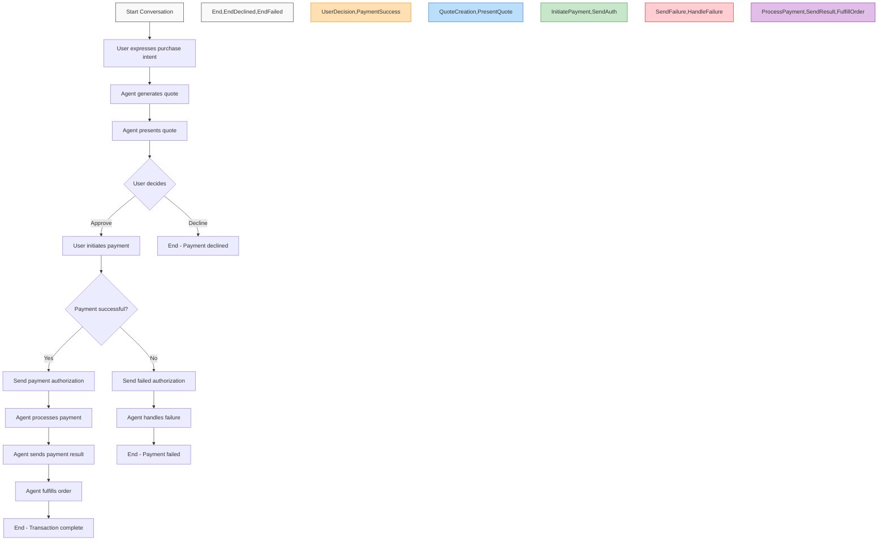

# AITP-04: Sample Payment Flows

* Spec Status: Draft
* Implementation Status: Live on NEAR AI

:::note Auto-generated Documentation
This documentation was auto-generated from the schema and examples by an AI model.
:::

This document provides examples of common payment flows using the AITP-04 Payments capability.



## Basic E-commerce Flow

This flow demonstrates a typical e-commerce transaction.

### Step 1: User initiates purchase

```
User: I'd like to buy the red shoes in size 9.
```

### Step 2: Agent confirms product and sends quote

```
Agent: I've found the red shoes in size 9. They are $79.99 plus $5 shipping.
```

```json
{
  "$schema": "https://aitp.dev/v1/payments/schema.json",
  "quote": {
    "type": "Quote",
    "quote_id": "order-12345",
    "payee_id": "shoe-store.near",
    "payment_plans": [
      {
        "plan_id": "standard-payment",
        "plan_type": "one-time",
        "amount": 84.99,
        "currency": "USD"
      }
    ],
    "valid_until": "2023-01-01T12:00:00Z"
  }
}
```

### Step 3: User approves payment

The client application handles the blockchain transaction and generates an authorization:

```json
{
  "$schema": "https://aitp.dev/v1/payments/schema.json",
  "payment_authorization": {
    "quote_id": "order-12345",
    "result": "success",
    "timestamp": "2023-01-01T10:15:22Z",
    "details": [
      {
        "network": "NEAR",
        "token_type": "USDC",
        "amount": 84.99,
        "account_id": "customer.near",
        "transaction_id": "8nT5xU3PvJYxqRm4GkVZBhF2abCN7C8dj3Q9rB4X1SfM"
      }
    ]
  }
}
```

### Step 4: Agent processes order and sends confirmation

```json
{
  "$schema": "https://aitp.dev/v1/payments/schema.json",
  "payment_result": {
    "quote_id": "order-12345",
    "result": "success",
    "timestamp": "2023-01-01T10:15:30Z",
    "message": "Thank you for your order! Your red shoes will be shipped soon.",
    "details": [
      {
        "label": "Order Number",
        "value": "ORD-12345",
        "url": "https://shoe-store.example.com/orders/12345"
      },
      {
        "label": "Estimated Delivery",
        "value": "January 5, 2023"
      },
      {
        "label": "Shipping Method",
        "value": "Standard Shipping"
      }
    ]
  }
}
```

### Step 5: Agent confirms completion

```
Agent: Your payment of $84.99 has been processed successfully! Your order number is ORD-12345, and you can track your order at https://shoe-store.example.com/orders/12345. Your red shoes, size 9, should arrive by January 5, 2023 via Standard Shipping.

Is there anything else you need help with today?
```

## Failed Payment Flow

This flow demonstrates a payment that fails during processing.

### Step 1: User initiates purchase

```
User: I want to subscribe to the premium service.
```

### Step 2: Agent sends quote

```
Agent: Our premium service is $29.99 per month. Would you like to proceed with payment?
```

```json
{
  "$schema": "https://aitp.dev/v1/payments/schema.json",
  "quote": {
    "type": "Quote",
    "quote_id": "premium-sub-789",
    "payee_id": "service-provider.near",
    "payment_plans": [
      {
        "plan_id": "premium-monthly",
        "plan_type": "one-time",
        "amount": 29.99,
        "currency": "USD"
      }
    ],
    "valid_until": "2023-01-01T12:00:00Z"
  }
}
```

### Step 3: User attempts payment but transaction fails

```json
{
  "$schema": "https://aitp.dev/v1/payments/schema.json",
  "payment_authorization": {
    "quote_id": "premium-sub-789",
    "result": "failure",
    "message": "Insufficient funds in wallet",
    "timestamp": "2023-01-01T10:20:15Z",
    "details": [
      {
        "network": "NEAR",
        "token_type": "USDC",
        "amount": 29.99,
        "account_id": "customer.near",
        "transaction_id": "N/A"
      }
    ]
  }
}
```

### Step 4: Agent acknowledges payment failure

```json
{
  "$schema": "https://aitp.dev/v1/payments/schema.json",
  "payment_result": {
    "quote_id": "premium-sub-789",
    "result": "failure",
    "timestamp": "2023-01-01T10:20:20Z",
    "message": "Your payment could not be processed due to insufficient funds.",
    "details": [
      {
        "label": "Error",
        "value": "Insufficient funds"
      },
      {
        "label": "Options",
        "value": "Try another payment method or add funds to your wallet"
      }
    ]
  }
}
```

### Step 5: Agent offers alternatives

```
Agent: I'm sorry, your payment of $29.99 couldn't be processed due to insufficient funds in your wallet. Would you like to try another payment method, or perhaps add funds to your wallet first?
```

## Multi-item Purchase Flow

This flow demonstrates purchasing multiple items in a single transaction.

### Step 1: User builds a shopping cart

```
User: I'd like to order a medium pizza with pepperoni and a 2-liter soda.
```

### Step 2: Agent confirms order and sends quote

```
Agent: I've added a medium pepperoni pizza ($12.99) and a 2-liter soda ($2.99) to your cart. With tax and delivery fee, your total comes to $19.47.
```

```json
{
  "$schema": "https://aitp.dev/v1/payments/schema.json",
  "quote": {
    "type": "Quote",
    "quote_id": "pizza-order-456",
    "payee_id": "pizza-place.near",
    "payment_plans": [
      {
        "plan_id": "standard-payment",
        "plan_type": "one-time",
        "amount": 19.47,
        "currency": "USD"
      }
    ],
    "valid_until": "2023-01-01T11:30:00Z"
  }
}
```

### Step 3: User approves payment

```json
{
  "$schema": "https://aitp.dev/v1/payments/schema.json",
  "payment_authorization": {
    "quote_id": "pizza-order-456",
    "result": "success",
    "timestamp": "2023-01-01T11:05:22Z",
    "details": [
      {
        "network": "NEAR",
        "token_type": "USDC",
        "amount": 19.47,
        "account_id": "customer.near",
        "transaction_id": "5Kj7uRfZpExWcSm2NzVYBvD1raPLnM9C3dg6Q8rD2TpN"
      }
    ]
  }
}
```

### Step 4: Agent processes order and sends confirmation

```json
{
  "$schema": "https://aitp.dev/v1/payments/schema.json",
  "payment_result": {
    "quote_id": "pizza-order-456",
    "result": "success",
    "timestamp": "2023-01-01T11:05:30Z",
    "message": "Thank you for your order! Your pizza and soda will be delivered soon.",
    "details": [
      {
        "label": "Order Number",
        "value": "ORD-456",
        "url": "https://pizza-place.example.com/track/456"
      },
      {
        "label": "Estimated Delivery",
        "value": "Today, 11:45 AM"
      },
      {
        "label": "Items",
        "value": "1x Medium Pepperoni Pizza, 1x 2-Liter Soda"
      }
    ]
  }
}
```

### Step 5: Agent provides order details

```
Agent: Your payment of $19.47 has been processed successfully! Your order number is ORD-456. Your medium pepperoni pizza and 2-liter soda should arrive by 11:45 AM. You can track your delivery at https://pizza-place.example.com/track/456.

Would you like to add any special delivery instructions?
```

## Digital Content Purchase Flow

This flow demonstrates purchasing and accessing digital content.

### Step 1: User requests digital content

```
User: I'd like to purchase access to the "Advanced AI Techniques" course.
```

### Step 2: Agent provides course details and quote

```
Agent: The "Advanced AI Techniques" course includes 12 video lectures, practical exercises, and a certificate upon completion. The price is $49.99 for lifetime access.
```

```json
{
  "$schema": "https://aitp.dev/v1/payments/schema.json",
  "quote": {
    "type": "Quote",
    "quote_id": "course-purchase-789",
    "payee_id": "learning-platform.near",
    "payment_plans": [
      {
        "plan_id": "lifetime-access",
        "plan_type": "one-time",
        "amount": 49.99,
        "currency": "USD"
      }
    ],
    "valid_until": "2023-01-02T00:00:00Z"
  }
}
```

### Step 3: User authorizes payment

```json
{
  "$schema": "https://aitp.dev/v1/payments/schema.json",
  "payment_authorization": {
    "quote_id": "course-purchase-789",
    "result": "success",
    "timestamp": "2023-01-01T15:30:22Z",
    "details": [
      {
        "network": "NEAR",
        "token_type": "USDC",
        "amount": 49.99,
        "account_id": "student.near",
        "transaction_id": "3Dp8vTqYxLjCnRf6GbVPBnS9waEfM7C5dh2Q1rX3SaK"
      }
    ]
  }
}
```

### Step 4: Agent processes payment and grants access

```json
{
  "$schema": "https://aitp.dev/v1/payments/schema.json",
  "payment_result": {
    "quote_id": "course-purchase-789",
    "result": "success",
    "timestamp": "2023-01-01T15:30:30Z",
    "message": "Thank you for purchasing the Advanced AI Techniques course! You now have lifetime access.",
    "details": [
      {
        "label": "Course Access",
        "value": "Advanced AI Techniques",
        "url": "https://learning-platform.example.com/courses/advanced-ai"
      },
      {
        "label": "Access Type",
        "value": "Lifetime"
      },
      {
        "label": "Receipt ID",
        "value": "RCP-789",
        "url": "https://learning-platform.example.com/receipts/789"
      }
    ]
  }
}
```

### Step 5: Agent provides access instructions

```
Agent: Thank you for your purchase! Your payment of $49.99 has been processed successfully. You now have lifetime access to the "Advanced AI Techniques" course.

You can access your course materials at: https://learning-platform.example.com/courses/advanced-ai

Your receipt is available at: https://learning-platform.example.com/receipts/789

The course includes 12 video lectures, practical exercises, and a completion certificate. Would you like me to give you an overview of the first lesson?
```

## Quote Expiration Flow

This flow demonstrates what happens when a payment quote expires.

### Step 1: User initiates purchase but delays payment

```
User: I'm interested in the annual subscription plan.
```

### Step 2: Agent sends quote with short expiration

```
Agent: Our annual subscription plan is $199.99, which saves you $39.89 compared to monthly billing. This quote is valid for the next 15 minutes.
```

```json
{
  "$schema": "https://aitp.dev/v1/payments/schema.json",
  "quote": {
    "type": "Quote",
    "quote_id": "annual-sub-123",
    "payee_id": "subscription-service.near",
    "payment_plans": [
      {
        "plan_id": "annual-plan",
        "plan_type": "one-time",
        "amount": 199.99,
        "currency": "USD"
      }
    ],
    "valid_until": "2023-01-01T12:15:00Z"
  }
}
```

### Step 3: User attempts payment after expiration

```json
{
  "$schema": "https://aitp.dev/v1/payments/schema.json",
  "payment_authorization": {
    "quote_id": "annual-sub-123",
    "result": "failure",
    "message": "Quote has expired",
    "timestamp": "2023-01-01T12:30:15Z",
    "details": [
      {
        "network": "NEAR",
        "token_type": "USDC",
        "amount": 199.99,
        "account_id": "customer.near",
        "transaction_id": "N/A"
      }
    ]
  }
}
```

### Step 4: Agent acknowledges expiration and offers new quote

```json
{
  "$schema": "https://aitp.dev/v1/payments/schema.json",
  "payment_result": {
    "quote_id": "annual-sub-123",
    "result": "failure",
    "timestamp": "2023-01-01T12:30:20Z",
    "message": "The payment quote has expired. Please request a new quote.",
    "details": [
      {
        "label": "Expired At",
        "value": "2023-01-01T12:15:00Z"
      },
      {
        "label": "Reason",
        "value": "Quote timeout"
      }
    ]
  }
}
```

### Step 5: Agent offers to generate a new quote

```
Agent: I'm sorry, but the payment quote has expired. It was valid until 12:15 PM, but your payment attempt was made at 12:30 PM. Would you like me to generate a new quote for the annual subscription plan at $199.99?
```

### Step 6: User confirms and receives new quote

```
User: Yes, please generate a new quote.
```

```json
{
  "$schema": "https://aitp.dev/v1/payments/schema.json",
  "quote": {
    "type": "Quote",
    "quote_id": "annual-sub-124",
    "payee_id": "subscription-service.near",
    "payment_plans": [
      {
        "plan_id": "annual-plan",
        "plan_type": "one-time",
        "amount": 199.99,
        "currency": "USD"
      }
    ],
    "valid_until": "2023-01-01T13:00:00Z"
  }
}
```

## Best Practices from these Examples

1. **Clear Communication**: Always provide clear natural language explanations alongside structured payment messages

2. **Transaction Details**: Include comprehensive details in payment results:
   - Order numbers
   - Delivery estimates
   - Access information for digital products
   - Receipt links

3. **Quote Management**:
   - Set appropriate expiration times based on context
   - Handle expired quotes gracefully
   - Make it easy to generate new quotes

4. **Error Handling**:
   - Provide specific error messages
   - Suggest remedies for common errors
   - Maintain a positive tone even during failures

5. **Security Considerations**:
   - Always reference the original quote ID
   - Verify payment amounts match exactly
   - Include blockchain transaction details

6. **User Experience**:
   - Confirm receipt of payment
   - Provide next steps after payment
   - Include relevant tracking or access information