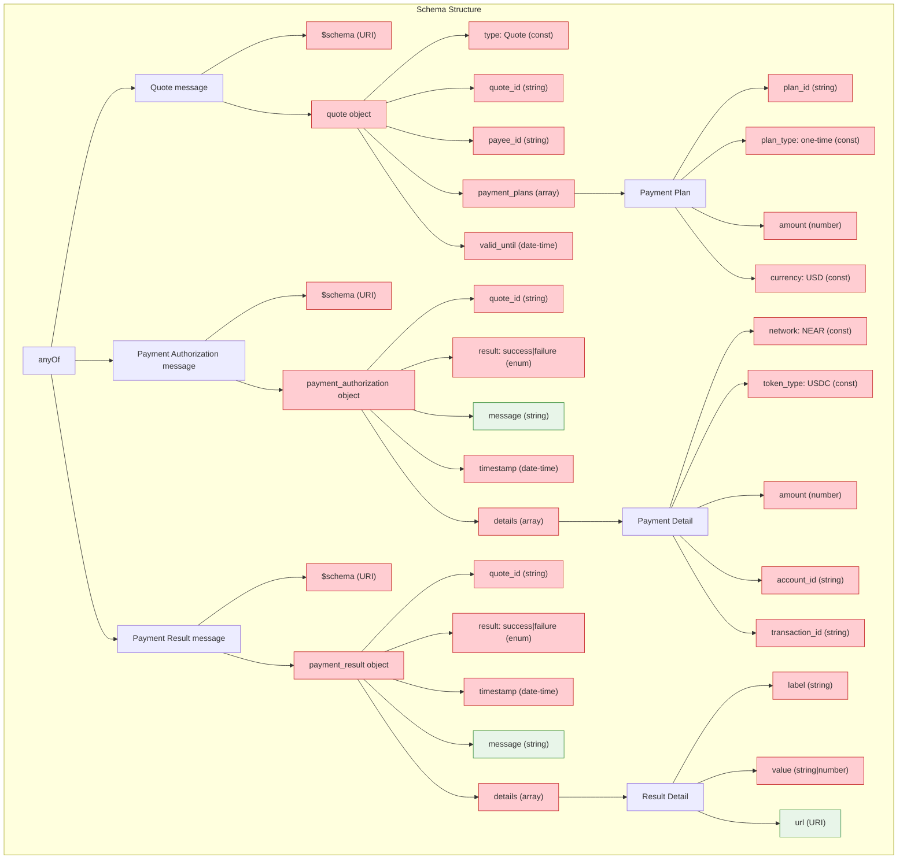

# AITP-04: Payments Schema Reference

* Spec Status: Draft
* Implementation Status: Live on NEAR AI

:::note Auto-generated Documentation
This documentation was auto-generated from the schema and examples by an AI model.
:::

## Schema URL

```
https://aitp.dev/capabilities/aitp-04-transactions/v1.0.0/schema.json
```

## Schema Overview



The AITP-04 Payments capability defines a JSON schema that supports three main message types:

1. **Quote** - A request for payment
2. **Payment Authorization** - Authorization of a payment
3. **Payment Result** - Confirmation of payment processing

## Complete Schema Definition

The schema is structured as an "anyOf" with three possible object types.

### Quote Schema

```json
{
  "type": "object",
  "properties": {
    "$schema": {
      "type": "string",
      "format": "uri"
    },
    "quote": {
      "type": "object",
      "properties": {
        "type": {
          "type": "string",
          "const": "Quote"
        },
        "quote_id": {
          "type": "string"
        },
        "payee_id": {
          "type": "string"
        },
        "payment_plans": {
          "type": "array",
          "items": {
            "type": "object",
            "properties": {
              "plan_id": {
                "type": "string"
              },
              "plan_type": {
                "type": "string",
                "const": "one-time"
              },
              "amount": {
                "type": "number"
              },
              "currency": {
                "type": "string",
                "const": "USD"
              }
            },
            "required": ["plan_id", "plan_type", "amount", "currency"],
            "additionalProperties": true
          }
        },
        "valid_until": {
          "type": "string",
          "format": "date-time"
        }
      },
      "required": [
        "type",
        "quote_id",
        "payee_id",
        "payment_plans",
        "valid_until"
      ],
      "additionalProperties": true
    }
  },
  "required": ["$schema", "quote"],
  "additionalProperties": false
}
```

### Payment Authorization Schema

```json
{
  "type": "object",
  "properties": {
    "$schema": {
      "type": "string",
      "format": "uri"
    },
    "payment_authorization": {
      "type": "object",
      "properties": {
        "quote_id": {
          "type": "string"
        },
        "result": {
          "type": "string",
          "enum": ["success", "failure"]
        },
        "message": {
          "type": "string"
        },
        "timestamp": {
          "type": "string",
          "format": "date-time"
        },
        "details": {
          "type": "array",
          "items": {
            "type": "object",
            "properties": {
              "network": {
                "type": "string",
                "const": "NEAR"
              },
              "token_type": {
                "type": "string",
                "const": "USDC"
              },
              "amount": {
                "type": "number"
              },
              "account_id": {
                "type": "string"
              },
              "transaction_id": {
                "type": "string"
              }
            },
            "required": [
              "network",
              "token_type",
              "amount",
              "account_id",
              "transaction_id"
            ],
            "additionalProperties": false
          }
        }
      },
      "required": ["quote_id", "result", "timestamp", "details"],
      "additionalProperties": true
    }
  },
  "required": ["$schema", "payment_authorization"],
  "additionalProperties": false
}
```

### Payment Result Schema

```json
{
  "type": "object",
  "properties": {
    "$schema": {
      "type": "string",
      "format": "uri"
    },
    "payment_result": {
      "type": "object",
      "properties": {
        "quote_id": {
          "type": "string"
        },
        "result": {
          "type": "string",
          "enum": ["success", "failure"]
        },
        "timestamp": {
          "type": "string",
          "format": "date-time"
        },
        "message": {
          "type": "string"
        },
        "details": {
          "type": "array",
          "items": {
            "type": "object",
            "properties": {
              "label": {
                "type": "string"
              },
              "url": {
                "type": "string",
                "format": "uri"
              },
              "value": {
                "type": ["string", "number"]
              }
            },
            "required": ["label", "value"],
            "additionalProperties": false
          }
        }
      },
      "required": ["quote_id", "result", "timestamp", "details"],
      "additionalProperties": true
    }
  },
  "required": ["$schema", "payment_result"],
  "additionalProperties": false
}
```

## Field Descriptions

### Quote Fields

| Field | Type | Required | Description |
|-------|------|----------|-------------|
| `$schema` | string | Yes | URI reference to the schema: `https://aitp.dev/capabilities/aitp-04-transactions/v1.0.0/schema.json` |
| `quote` | object | Yes | Container for the quote |
| `quote.type` | string | Yes | Must be "Quote" |
| `quote.quote_id` | string | Yes | Unique identifier for this quote |
| `quote.payee_id` | string | Yes | Identifier for the payment recipient |
| `quote.payment_plans` | array | Yes | Array of payment options |
| `quote.payment_plans[].plan_id` | string | Yes | Unique identifier for this payment plan |
| `quote.payment_plans[].plan_type` | string | Yes | Must be "one-time" |
| `quote.payment_plans[].amount` | number | Yes | Amount to be paid |
| `quote.payment_plans[].currency` | string | Yes | Must be "USD" |
| `quote.valid_until` | string | Yes | ISO 8601 expiration date/time |

### Payment Authorization Fields

| Field | Type | Required | Description |
|-------|------|----------|-------------|
| `$schema` | string | Yes | URI reference to the schema: `https://aitp.dev/capabilities/aitp-04-transactions/v1.0.0/schema.json` |
| `payment_authorization` | object | Yes | Container for the authorization |
| `payment_authorization.quote_id` | string | Yes | Reference to the quote being paid |
| `payment_authorization.result` | string | Yes | Result of the authorization: "success" or "failure" |
| `payment_authorization.message` | string | No | Optional message about the result |
| `payment_authorization.timestamp` | string | Yes | ISO 8601 timestamp of authorization |
| `payment_authorization.details` | array | Yes | Array of payment details |
| `payment_authorization.details[].network` | string | Yes | Must be "NEAR" |
| `payment_authorization.details[].token_type` | string | Yes | Must be "USDC" |
| `payment_authorization.details[].amount` | number | Yes | Amount that was authorized |
| `payment_authorization.details[].account_id` | string | Yes | Account identifier of the payer |
| `payment_authorization.details[].transaction_id` | string | Yes | Blockchain transaction identifier |

### Payment Result Fields

| Field | Type | Required | Description |
|-------|------|----------|-------------|
| `$schema` | string | Yes | URI reference to the schema: `https://aitp.dev/capabilities/aitp-04-transactions/v1.0.0/schema.json` |
| `payment_result` | object | Yes | Container for the result |
| `payment_result.quote_id` | string | Yes | Reference to the quote that was paid |
| `payment_result.result` | string | Yes | Result of processing: "success" or "failure" |
| `payment_result.timestamp` | string | Yes | ISO 8601 timestamp of processing |
| `payment_result.message` | string | No | Optional message about the result |
| `payment_result.details` | array | Yes | Array of result details |
| `payment_result.details[].label` | string | Yes | Label for this detail |
| `payment_result.details[].value` | string/number | Yes | Value for this detail |
| `payment_result.details[].url` | string | No | Optional URL for more information |

## Schema Constraints

### Current Limitations

:::caution Constraints
1. **Payment Networks**: Currently only supports the NEAR blockchain
2. **Tokens**: Currently only supports USDC tokens
3. **Currency**: Currently only supports USD
4. **Plan Types**: Currently only supports one-time payments
:::

The schema enforces these constraints with constant values. For example:

```json
"network": {
  "type": "string",
  "const": "NEAR"
},
"token_type": {
  "type": "string",
  "const": "USDC"
},
"currency": {
  "type": "string",
  "const": "USD"
},
"plan_type": {
  "type": "string",
  "const": "one-time"
}
```

## Example Messages

### Quote Example

```json
{
  "$schema": "https://aitp.dev/capabilities/aitp-04-transactions/v1.0.0/schema.json",
  "quote": {
    "type": "Quote",
    "quote_id": "quote_123",
    "payee_id": "merchant.near",
    "payment_plans": [
      {
        "plan_id": "plan_123",
        "plan_type": "one-time",
        "amount": 2.5,
        "currency": "USD"
      }
    ],
    "valid_until": "2050-01-01T00:00:00Z"
  }
}
```

### Payment Authorization Example

```json
{
  "$schema": "https://aitp.dev/capabilities/aitp-04-transactions/v1.0.0/schema.json",
  "payment_authorization": {
    "quote_id": "quote_123",
    "result": "success",
    "timestamp": "2050-01-01T00:00:00Z",
    "details": [
      {
        "network": "NEAR",
        "token_type": "USDC",
        "amount": 2.5,
        "account_id": "customer.near",
        "transaction_id": "7vjj6uqQeyYciPNhA9jiRvfH98LVeJ7C8df4Q9rA3SfN"
      }
    ]
  }
}
```

### Payment Result Example

```json
{
  "$schema": "https://aitp.dev/capabilities/aitp-04-transactions/v1.0.0/schema.json",
  "payment_result": {
    "quote_id": "quote_123",
    "result": "success",
    "timestamp": "2050-01-01T00:00:00Z",
    "message": "Your red socks are on their way!",
    "details": [
      {
        "label": "Some Number",
        "value": 123,
        "url": "https://near.ai"
      },
      {
        "label": "Color",
        "value": "Red"
      }
    ]
  }
}
```

## Schema Validation Rules

1. All required fields must be present
2. Fields with constant values must match exactly
3. `amount` fields must be valid numbers
4. Date-time fields must be in ISO 8601 format
5. URLs must be valid URI format
6. Arrays must contain at least one item
7. Enum fields must match one of the specified values

## Schema Versioning

The schema URL includes a version number that follows semver:

```
https://aitp.dev/capabilities/aitp-04-transactions/v1.0.0/schema.json
```

Future versions will maintain backward compatibility within the same major version.