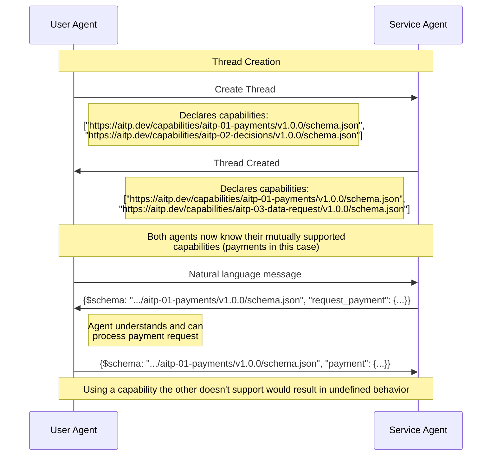

# Capabilities

Capabilities are standards for specialized messages to enable structured interactions, e.g. for processing payments or sharing sensitive data. Agents or clients announce which capabilities they support when starting or joining a thread.  The other agents in the thread can then tailor their responses to make use of those capabilities.

The core communication mechanism of AITP is a natural-language chat thread, and even without any Capabilities, agents could express everything in natural language.  But  
a structured communication protocol allows systems of people and agents to “snap together”, following the maxim that easy things should be easy and hard things should be possible.

AITP Capabilities have several benefits over unstructured communication. For example, Clients, Tools and Agent code can operate directly on the structure, validating and correcting protocol outputs produced by an LLM. Additionally, API call outputs can be directly transformed into AITP messages, and expected messages can be routed programmatically, eliminating the need for LLM interpretation. All of these processes reduce variability, latency, and cost.

Capabilities can use `Thread.messages[].content[]` to communicate structured information serialized into JSON between actors that both support that capability.

For example:
```json
{
    "messages": [
        {"role": "assistant", "content": ["{\"$schema\": \"https://crates.io/crates/aitp_schema/capabilities/aitp-04-transactions/v1.0.0/schema.json\", \"type\": \"request_payment\": {...}}"]}
    ]
}
```

## What is a Capability?

A capability consists of a set of JSON schemas (also called message types), which define how to create structured JSON chat messages.  Any client or agent that declares support for a capability must be able to interpret and act on any message of any message type defined by the capability.

## Capability Versioning

Each capability is versioned within the URL of its JSON schema.  The schema should use semver (`vMAJOR.MINOR.PATCH`) style versioning, where:
* MAJOR version is incremented for breaking changes (e.g. removing/renaming fields).
* MINOR version is incremented for backward-compatible additions (e.g. new optional fields that can be safely ignored by older clients).
* PATCH version is incremented for non-functional changes (e.g. documentation fixes; no client impact).

Version numbers should start at v1.0.0, even for early drafts, since semver behavior is less well-defined when using v0.x.

To support the maximal amount of functionality, the parties in a thread need to determine the maximum version of each capability supported by all parties.  Therefore:
* Agents should declare a range of supported major versions that's as wide as possible.
* Agents sending an AITP message should use the highest major version known to all parties, and any minor version within that major version.
* Agents receiving an AITP message should ignore unknown fields, to handle newer minor versions gracefully.

## Capability Exchange



When starting or joining a thread, each agent or client needs to declare which capabilities and capability versions it supports.  Capability exchange is the responsibility of the Transport; it is not contained in the messages.  For instance, for the the AITP-T01 Thread API transport, capabilities are defined as an array of schema URLs passed into the `POST /v1/thread` endpoint.

## Capability List

| Capability ID                                              | Schema                                                                     | Description                                                                          | Spec Status | Implementation Status |
|------------------------------------------------------------|----------------------------------------------------------------------------|--------------------------------------------------------------------------------------|-------------|-----------------------|
| [AITP-01: Payments](capabilities/aitp-01-payments)         |                                                                            | Agent-native payment requests, authorizations, and post-processing                   | Ideation    | None                  |
| [AITP-02: Decisions](capabilities/aitp-02-decisions)       | [v1.0.0](pathname:///capabilities/aitp-02-decisions/v1.0.0/schema.json)    | Requesting decisions or actions from an agent or to be displayed in a user interface | Draft       | Live on NEAR AI       |
| [AITP-03: Data Request](capabilities/aitp-03-data-request) | [v1.0.0](pathname:///capabilities/aitp-03-data-request/v1.0.0/schema.json) | Supporting requesting and dealing with structured data like passwords and addresses  | Draft       | Live on NEAR AI       |
| [AITP-04: Transactions](capabilities/aitp-04-transactions) | [v1.0.0](pathname:///capabilities/aitp-04-transactions/v1.0.0/schema.json) | P2P crypto transactions, using coins or tokens; less functionality than Payments     | Draft       | Live on NEAR AI       |
| [AITP-05: Signatures](capabilities/aitp-05-signatures)     |                                                                            | Digital signatures for messages, authentication, and blockchain transactions         | Ideation    | None                  |

Future capabilities could include:
* Operational concerns like healthchecks
* Legacy forms of payment, like credit/debit cards or invoices
