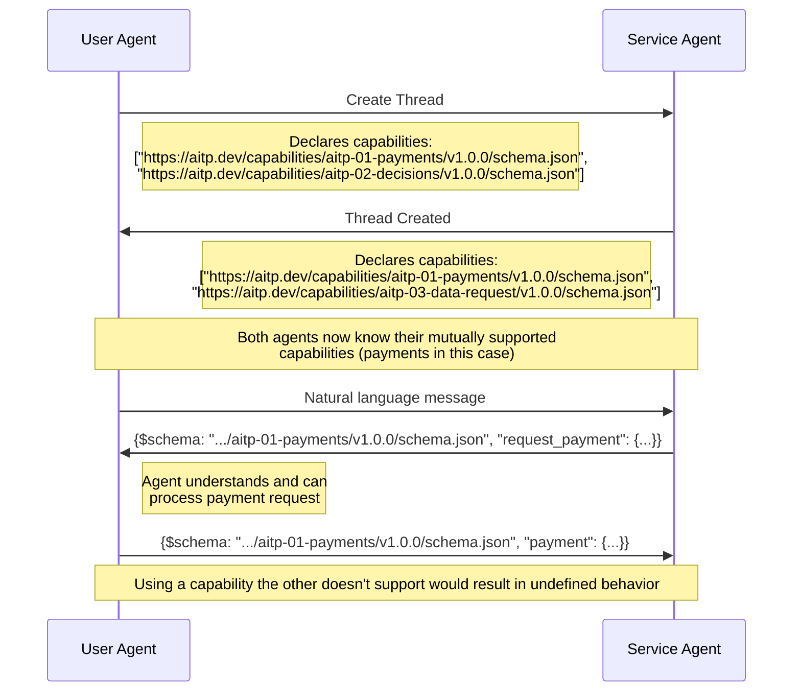
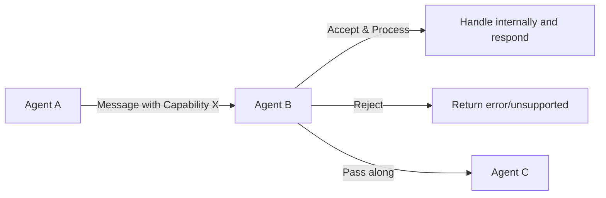

# Capabilities

Capabilities are standards for specialized messages to enable structured interactions, e.g. for processing payments or sharing sensitive data. Agents or clients announce which capabilities they support when starting or joining a thread.  The other agents in the thread can then tailor their responses to make use of those capabilities.

While agents can communicate anything through natural language chat thread, capabilities provide standardized structured formats for common interactions. For example:

- Instead of an agent saying "Here are your flight options: Option 1...", it can send a structured `decision` request that your UI can render as a proper selection interface
- Instead of describing payment amounts in text, an agent can send a payment quote with exact amounts that can be programmatically verified and executed
- Rather than asking for your shipping address in conversation, an agent can send a form request that your UI renders as a proper address entry form

This structured approach reduces ambiguity, enables validation, and allows UIs to present information optimally.

AITP Capabilities have several benefits over unstructured communication. For example, Clients, Tools and Agent code can operate directly on the structure, validating and correcting protocol outputs produced by an LLM. Additionally, API call outputs can be directly transformed into AITP messages, and expected messages can be routed programmatically, eliminating the need for LLM interpretation. All of these processes reduce variability, latency, and cost.

Capabilities can use `Thread.messages[].content[]` to communicate structured information serialized into JSON between actors that both support that capability.

For example:
```json
{
    "messages": [
        {"role": "assistant", "content": ["{\"$schema\": \"https://crates.io/crates/aitp_schema/capabilities/aitp-04-transactions/v1.0.0/schema.json\", \"type\": \"request_payment\": {...}}"]}
    ]
}
```

## What is a Capability?

A capability consists of a set of JSON schemas (also called message types), which define how to create structured JSON chat messages.  Any client or agent that declares support for a capability must be able to interpret and act on any message of any message type defined by the capability.

## Capability Versioning

Each capability is versioned within the URL of its JSON schema.  The schema should use semver (`vMAJOR.MINOR.PATCH`) style versioning, where:
* MAJOR version is incremented for breaking changes (e.g. removing/renaming fields).
* MINOR version is incremented for backward-compatible additions (e.g. new optional fields that can be safely ignored by older clients).
* PATCH version is incremented for non-functional changes (e.g. documentation fixes; no client impact).

Version numbers should start at v1.0.0, even for early drafts, since semver behavior is less well-defined when using v0.x.

To support the maximal amount of functionality, the parties in a thread need to determine the maximum version of each capability supported by all parties.  Therefore:
* Agents should declare a range of supported major versions that's as wide as possible.
* Agents sending an AITP message should use the highest major version known to all parties, and any minor version within that major version.
* Agents receiving an AITP message should ignore unknown fields, to handle newer minor versions gracefully.

## Capability Exchange



When starting or joining a thread, each agent or client needs to declare which capabilities and capability versions it supports.  Capability exchange is the responsibility of the Transport; it is not contained in the messages.  For instance, for the the AITP-T01 Thread API transport, capabilities are defined as an array of schema URLs passed into the `POST /v1/thread` endpoint.

## Message Passthrough Pattern

A powerful feature of AITP is the message passthrough pattern, where agents can forward capability messages they don't necessarily handle themselves. This "accept, reject, or pass along" pattern enables the creation of flexible agent networks.


With this pattern:

* Agents can declare support for capabilities they intend to pass to others
* Personal assistants can forward messages to specialized agents
* Service agents can relay requests through middleware
* Discovery agents can collect and forward responses

This is particularly important for multi-agent systems where each agent has different specializations. An agent might declare support for payment capabilities not because it handles payments directly, but because it maintains a thread with a payment processor agent.

## Capability List

| Capability ID                                                | Schema                                                                     | Description                                                                          | Spec Status | Implementation Status |
|--------------------------------------------------------------|----------------------------------------------------------------------------|--------------------------------------------------------------------------------------|-------------|-----------------------|
| [AITP-01: Payments](capabilities/aitp-01-payments)           |                                                                            | Agent-native payment protocol for user-to-agent and agent-to-agent payments          | Ideation    | In Development        |
| [AITP-02: Decisions](capabilities/aitp-02-decisions)         | [v1.0.0](pathname:///capabilities/aitp-02-decisions/v1.0.0/schema.json)    | Requesting decisions or actions from an agent or to be displayed in a user interface | Draft       | Live on NEAR AI       |
| [AITP-03: Data Request](capabilities/aitp-03-data-request)   | [v1.0.0](pathname:///capabilities/aitp-03-data-request/v1.0.0/schema.json) | Requesting and responding with structured data like passwords and addresses          | Draft       | Live on NEAR AI       |
| [AITP-04: NEAR Wallet](capabilities/aitp-04-near-wallet)     | [v1.0.0](pathname:///capabilities/aitp-04-near-wallet/v1.0.0/schema.json)  | Interaction with NEAR blockchain accounts for transaction and message signing        | Draft       | In Development        |
| [AITP-05: EVM Wallet](capabilities/aitp-05-evm-wallet)       | [v1.0.0](pathname:///capabilities/aitp-05-evm-wallet/v1.0.0/schema.json)   | Interaction with Ethereum and EVM-compatible blockchain wallets                      | Draft       | Planned               |
| [AITP-06: Solana Wallet](capabilities/aitp-06-solana-wallet) |                                                                            | Interaction with Solana blockchain wallets (placeholder)                             | Planned     | Planned               |

Future capabilities could include:
* Operational concerns like healthchecks
* Legacy forms of payment, like credit/debit cards or invoices

## Developing New Capabilities

When considering developing a new AITP capability, follow these guidelines:

### When to Create a New Capability
- The interaction pattern is common across multiple domains (see below)
- It requires structured data that can't be easily communicated in natural language
- It would benefit from standardization across different implementations
- It crosses trust boundaries between agents or systems

### When to Extend an Existing Capability
- The new functionality fits within the scope of an existing capability
- Only minor additions are needed to support your use case
- Backward compatibility can be maintained

The community will review proposals based on general applicability, schema quality, and implementation feasibility.

Capabilities in this official spec should be common across multiple domains, but for more specific functionality (e.g. within an industry), the protocol is extensible so you can define a schema, host it anywhere, and agree on its use among participants.