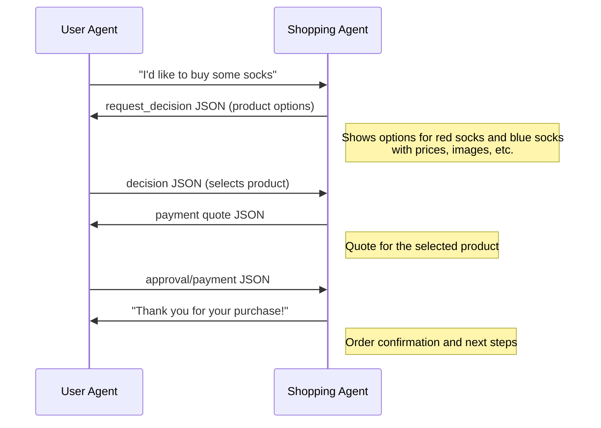

# AITP Examples

AITP is a generic protocol for interacting between agents with ability to exchange value. This document showcases specific interaction examples.

## User interacting with Travel Agent



Overview

```json
{
  "agents": [
    {"id": "root.near", "capabilities": [
      {"$schema": "https://aitp.dev/capabilities/aitp-01-payments/v0.1.0/schema.json"},
      {"$schema": "https://aitp.dev/capabilities/aitp-02-decisions/v1.0.0/schema.json"}
    ]},
    {"id": "hub.near.ai/travel-agent/0.1.0", "capabilities": [
      {"$schema": "https://aitp.dev/capabilities/aitp-01-payments/v0.1.0/schema.json" }
    ]}
  ],
  "messages": [
    {"metadata": {"actor": "root.near"},
      "content": ["plan me a trip to NY"],
      "role":  "user"},
    ...
    {"metadata": {"actor": "hub.near.ai/travel-agent/0.1.0"},
      "content": ["{\"$schema\": \"https://aitp.dev/capabilities/aitp-01-payments/v0.1.0/schema.json\", \"quote\": {...}}"],
      "role":  "assistant"},
    {"metadata": {"actor": "root.near"},
      "content": ["{\"$schema\": \"https://aitp.dev/capabilities/aitp-01-payments/v0.1.0/schema.json\", \"payment\": {...}}"],
      "role":  "user"}
  ]
}
```

Create Thread

```json
{
  "id": "thread_travel-agent-1",
  "metadata": {
    "parent_id": "thread_7518075837403837",
    "actors": "[{\"id\": \"root.near\", \"capabilities\": [{\"$schema\": \"https://aitp.dev/v1/payments.schema.json\"}, {\"$schema\": \"https://aitp.dev/v1/requests.schema.json\"}]},{\"id\": \"hub.near.ai/travel-agent/0.1.0\", \"capabilities\": [{\"$schema\": \"https://aitp.dev/v1/payments.schema.json\"}]}]"
  }
}
```

Create an AITP Message
```json
{
  "thread_id": "thread_travel-agent-1",
  "role": "assistant",
  "metadata": {
    "actor": "hub.near.ai/travel-agent/0.1.0"
  },
  "content": [
    "{\"$schema\": \"https://aitp.dev/v1/requests.schema.json\", \"request_decision\": {\"type\": \"product\", \"options\": [{\"id\": 1, \"image_url\": \"https://...\", \"name\": \"Red Socks\", \"price\": {\"usd\": 10.5 },\"url\": \"https://amazon.com/...\"}, {\"id\": 2,\"image_url\": \"https://...\",\"name\": \"Blue Socks\",\"price\": {\"usd\": 9 },\"url\": \"https://amazon.com/...\"}]}}"      ]
}
```

GET Thread that has several messages
```json
{
  "id": "thread_travel-agent-1",
  "metadata": {
    "parent_id": "thread_7518075837403837",
    "actors": "[{\"id\": \"root.near\", \"capabilities\": [{\"$schema\": \"https://aitp.dev/v1/payments.schema.json\"}, {\"$schema\": \"https://aitp.dev/v1/requests.schema.json\"}]},{\"id\": \"hub.near.ai/travel-agent/0.1.0\", \"capabilities\": [{\"$schema\": \"https://aitp.dev/v1/payments.schema.json\"}]}]"
  },
  "messages": [
    {
      "metadata": {
        "actor": "root.near"
      },
      "content": [
        "I'd like to buy some socks"
      ]
    },
    {
      "metadata": {
        "actor": "hub.near.ai/travel-agent/0.1.0"
      },
      "content": [
        "{\"$schema\": \"https://aitp.dev/v1/requests.schema.json\", \"request_decision\": {\"type\": \"product\", \"options\": [{\"id\": 1, \"image_url\": \"https://...\", \"name\": \"Red Socks\", \"price\": {\"usd\": 10.5 },\"url\": \"https://amazon.com/...\"}, {\"id\": 2,\"image_url\": \"https://...\",\"name\": \"Blue Socks\",\"price\": {\"usd\": 9 },\"url\": \"https://amazon.com/...\"}]}}"      ]
    },
    {
      "metadata": {
        "actor": "root.near"
      },
      "content": [
        "{\"$schema\": \"https://aitp.dev/v1/payments.schema.json\", \"quote\": { \"quote_id\": \"quote_1234\",\"payee_id\": \"demo-shopper.near\",\"payment_plans\": [{\"plan_id\": \"...\", \"plan_type\": \"one-time\", \"amount\": 123.45, \"currency\": \"USD\"}, {\"plan_id\": \"...\", \"plan_type\": \"subscription\", \"recurring_details\": { \"interval\": \"monthly\", \"amount\": 9.99, \"currency\": \"USD\"}}],\"valid_until\": \"2025-12-31 12:00:00\"}}"
      ]
    }
  ]
}
```
