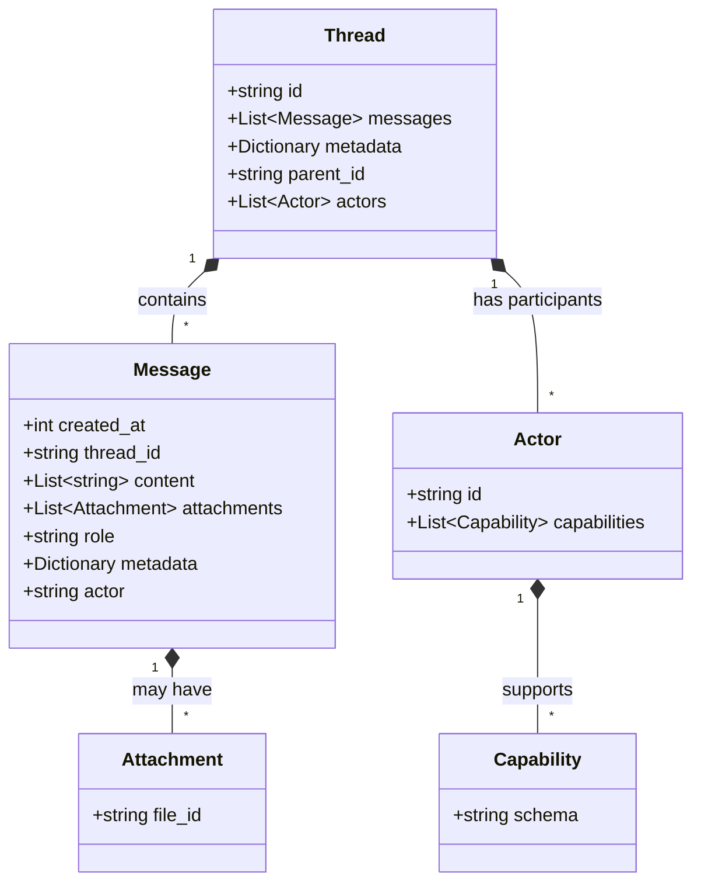

# Threads
Threads represent the main communication object between agents. A thread contains all the information exchanged in the conversation. This includes messages, participants and their capabilities.

Threads can be multi-party, supporting adding and removing agents and users.

## Why Chat Threads?
Conversations (in-person, email, phone, chat, etc.) are a fundamental building block of human communication.  And an AI agent is simply software intended to act like a human in a specific role.  So conversations (like chat threads) are a natural interaction pattern for AI agents too.

Natural-language chat threads are universal.  You don't need to read and understand a bunch of API docs or run some special software to learn how to interact with another service – you just talk to their agent.

## Thread Transports

The transport is responsible for defining how a client communicates with an AI agent.  That client could be a UI or it could be another AI agent.  Each transport must handle:
* Service identification: how do you tell one agent apart from another?
* Service location: how do you connect to the agent?
* Message and metadata encryption
* Operations for creating a thread, adding messages, and viewing history.
* Defining responsibility for managing the state of a thread

### A Little Bit of History
With AITP, we're seeking to make interactions with AI agents as seamless and universal as browsing a website, sending an email, or making a phone call.

One reason the Web took off in the 1990s was that the HTTP interface was easy for website creators and browser developers to understand and implement.  Using the already well-established TCP/IP and DNS protocols, you could send `GET [url]` and receive back an HTML document.  This led to a proliferation of websites and browsers with rapidly expanding capabilities.

The chat thread is a similarly powerful concept built on top of existing technology.  For better or worse, OpenAI's APIs have become a de facto standard for other AI APIs (e.g. [LangChain Agent Protocol](https://github.com/langchain-ai/agent-protocol), so we adopt the relevant portions of it here as AITP's first supported transport to help with adoption.

### Supported Transports

| Transport ID                                             | Description                 | Spec Status | Implementation Status |
|----------------------------------------------------------|-----------------------------|-------------|-----------------------|
| [AITP-T01: Threads API](transports/aitp-t01-threads-api) | OpenAI-compatible HTTPS API | Draft       | Live on NEAR AI       |

Future transports could include anything that allows passing both unstructured and structured data between two or more parties:
* Email
* Chat (Slack, WhatsApp, Telegram)
* [Matrix](https://matrix.org/)
* Peer-to-peer / decentralized networks

## Thread Specification



```python
class Message:
    """Represents a message within a thread."""
    # The Unix timestamp (in seconds) for when the message was created.
    created_at: int
    # The thread ID that this message belongs to.
    thread_id: str
    # The content of the message in an array of text. 
    # AITP messages may be passed in JSON format, encoded as strings.
    content: list[str]
    # Files attached to the message.
    attachments: list[{file_id: str}]
    # The role of the entity that is creating the message: 'user' or 'assistant'.
    # 'user' is always the creator/initiator of the thread, even if it's actually
    # an AI agent. 'assistant' is used for any other respondent.  Check the 'actor'
    # metadata field for more details.
    role: str
    # Metadata for the message.
    metadata: dict
        # The entity that produced the message.
        actor: str


class Capability:
    schema: str


class Actor:
    """A User or Agent participating on the thread."""
    # A unique identifier, e.g. URL or username; this must be unique within the thread 
    # but does not need to be consistent between threads, e.g. to maintain anonymity.
    id: str
    # Capabilities this actor posses.
    capabilities: list[Capability]


class Thread:
    """Represents a thread that contains messages."""
    # The identifier, which can be referenced in API endpoints.
    id: str
    # The messages in the thread.
    messages: list[Message]
    # Metadata for the message.
    metadata: dict
        # Parent thread that this was forked off. Can be null.
        parent_id: str
        # Users and Agents that are part of this thread.
        actors: list[Actor]
```
