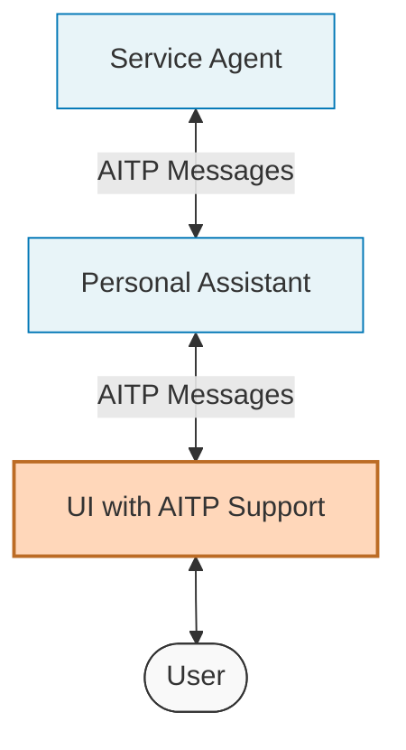
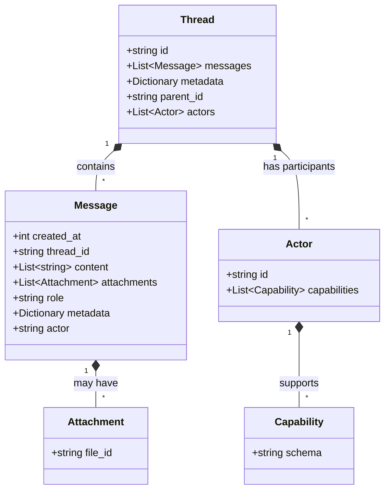

# Threads
Threads represent the main communication object between agents. A thread contains all the information exchanged in the conversation. This includes messages, participants and their capabilities.

Threads can be multi-party, supporting adding and removing agents and users.

## Why Chat Threads?

Chat threads are the perfect foundation for agent interactions for several reasons:

**Universal Understanding:**
- Conversations are intuitive for both humans and AI models
- No special training needed for basic interaction
- Natural fallback when structured capabilities aren't available

**Flexibility and Context:**
- Maintains conversation history for context
- Supports both structured and unstructured communication

**Technical Benefits:**
- Easy to persist and retrieve
- Simple to display in user interfaces
- Compatible with existing messaging systems
- Allows for asynchronous communication

**Business Logic:**
- Maps to real-world conversation patterns
- Supports multiple participants
- Can be audited for compliance
- Preserves decision-making history

Natural-language chat is the universal lowest common denominator for agent interaction. You don't need specialized API knowledge or custom UIs to talk to an agent – plain text suffices, while capabilities provide enhanced functionality when available.

## User Interfaces and AITP

While AITP facilitates agent-to-agent communication, it's equally important for user interfaces to support AITP capabilities. UIs serve as the "last mile" in many AITP workflows by:

- Rendering structured decision requests as proper selection UIs
- Displaying payment requests as secure payment forms
- Presenting data collection forms with appropriate validation
- Converting user actions back into AITP-compatible messages



A complete AITP ecosystem requires both agent frameworks and UI toolkits to support the protocol. This enables seamless experiences where structured data flows from service agents through personal assistants to user interfaces and back again.
Many implementations will pass AITP capability messages directly to the UI when the personal assistant can't handle them itself. This makes UI support for AITP capabilities an essential part of the ecosystem rather than just an optional enhancement.

## Thread Transports

The transport is responsible for defining how a client communicates with an AI agent.  That client could be a UI or it could be another AI agent.  Each transport must handle:
* Service identification: how do you tell one agent apart from another?
* Service location: how do you connect to the agent?
* Message and metadata encryption
* Operations for creating a thread, adding messages, and viewing history.
* Defining responsibility for managing the state of a thread

### Historical Context

With AITP, we aim to make agent interactions as universal as web browsing. The Web succeeded in the 1990s, beating out closed, curated networks like AOL, largely because HTTP was simple yet powerful - send `GET [url]`, receive HTML. This simplicity drove rapid adoption.

Similarly, chat threads provide an intuitive, universal interface for agent communication. And for better or worse, OpenAI's APIs have become a de facto standard for other AI APIs (e.g. [LangChain Agent Protocol](https://github.com/langchain-ai/agent-protocol), so we adopt the relevant portions of it here as AITP's first supported transport to help with adoption.

## Thread Example

Here's a complete example of an AITP thread with two actors exchanging messages:

```json
{
  "id": "thread_abc123",
  "metadata": {
    "parent_id": null,
    "actors": [
      {
        "id": "user-agent.near",
        "capabilities": [
          {"schema": "https://aitp.dev/capabilities/aitp-01-payments/v1.0.0/schema.json"},
          {"schema": "https://aitp.dev/capabilities/aitp-02-decisions/v1.0.0/schema.json"}
        ]
      },
      {
        "id": "travel-agent.near",
        "capabilities": [
          {"schema": "https://aitp.dev/capabilities/aitp-01-payments/v1.0.0/schema.json"},
          {"schema": "https://aitp.dev/capabilities/aitp-03-data-request/v1.0.0/schema.json"}
        ]
      }
    ]
  },
  "messages": [
    {
      "created_at": 1708950000,
      "thread_id": "thread_abc123",
      "content": ["I need to book a flight to Miami next month"],
      "role": "user",
      "metadata": {
        "actor": "user-agent.near"
      }
    },
    {
      "created_at": 1708950060,
      "thread_id": "thread_abc123",
      "content": ["{\"$schema\": \"https://aitp.dev/capabilities/aitp-02-decisions/v1.0.0/schema.json\", \"request_decision\": {\"id\": \"flight_options\", \"type\": \"radio\", \"options\": [{\"id\": \"f1\", \"name\": \"Economy: $299\"}, {\"id\": \"f2\", \"name\": \"Business: $799\"}]}}"],
      "role": "assistant",
      "metadata": {
        "actor": "travel-agent.near"
      }
    },
    {
      "created_at": 1708950120,
      "thread_id": "thread_abc123",
      "content": ["{\"$schema\": \"https://aitp.dev/capabilities/aitp-02-decisions/v1.0.0/schema.json\", \"decision\": {\"request_decision_id\": \"flight_options\", \"options\": [{\"id\": \"f2\"}]}}"],
      "role": "user",
      "metadata": {
        "actor": "user-agent.near"
      }
    }
  ]
}
```

In this example:
- Two actors are participating: a user agent and a travel agent
- Each has declared their supported capabilities
- The travel agent is using the Decisions capability to present flight options
- The user agent responds with a structured decision rather than natural language

### Supported Transports

| Transport ID                                             | Description                 | Spec Status | Implementation Status |
|----------------------------------------------------------|-----------------------------|-------------|-----------------------|
| [AITP-T01: Threads API](transports/aitp-t01-threads-api) | OpenAI-compatible HTTPS API | Draft       | Live on NEAR AI       |

Future transports could include anything that allows passing both unstructured and structured data between two or more parties:
* Email
* Chat (Slack, WhatsApp, Telegram)
* [Matrix](https://matrix.org/)
* Peer-to-peer / decentralized networks
* Phone call, plus [ggwave](https://github.com/ggerganov/ggwave)

## Thread Specification



```python
class Message:
    """Represents a message within a thread."""
    # The Unix timestamp (in seconds) for when the message was created.
    created_at: int
    # The thread ID that this message belongs to.
    thread_id: str
    # The content of the message in an array of text. 
    # AITP messages may be passed in JSON format, encoded as strings.
    content: list[str]
    # Files attached to the message.
    attachments: list[{file_id: str}]
    # The role of the entity that is creating the message: 'user' or 'assistant'.
    # 'user' is always the creator/initiator of the thread, even if it's actually
    # an AI agent. 'assistant' is used for any other respondent.  Check the 'actor'
    # metadata field for more details.
    role: str
    # Metadata for the message.
    metadata: dict
        # The entity that produced the message.
        actor: str


class Capability:
    schema: str


class Actor:
    """A User or Agent participating on the thread."""
    # A unique identifier, e.g. URL or username; this must be unique within the thread 
    # but does not need to be consistent between threads, e.g. to maintain anonymity.
    id: str
    # Capabilities this actor posses.
    capabilities: list[Capability]


class Thread:
    """Represents a thread that contains messages."""
    # The identifier, which can be referenced in API endpoints.
    id: str
    # The messages in the thread.
    messages: list[Message]
    # Metadata for the message.
    metadata: dict
        # Parent thread that this was forked off. Can be null.
        parent_id: str
        # Users and Agents that are part of this thread.
        actors: list[Actor]
```

## Authentication & Identity

Many agent frameworks talk a lot about universal identifiers for agents, and authentication mechanisms for agents.  These concepts are intentionally absent from AITP spec.

In AITP, agents have IDs that are only unique to the current thread.  Agents can choose to identify themselves consistently between threads, or not.  There's no reason to _enforce_ de-anonymization at the protocol level.  If agents want to prove a consistent identity between threads, they can do that by signing a message against a published public key – that might be useful future AITP capability.

Agent identifiers have also been proposed as a means to address or locate an agent.  AITP doesn't define a central or decentralized directory of agents; each Transport defines how to find or connect to agents.  In the case of [AITP-T01 Threads API](transports/aitp-t01-threads-api.md), agents are identified by simple HTTPS endpoint URLs.  Just like with classic APIs, those URLs can be indexed by a search engine, or catalogued manually.

Beyond agent identity, cryptographic proof of **human** involvement is a valuable concept for the AITP ecosystem. We're planning to release new AITP capabilities that cryptographically attest that a human has viewed critical information (like legal disclosures) or explicitly approved a decision. To prevent agent impersonation of humans, these attestations should originate from trusted hardware, such as the secure enclaves in mobile phones, computers, or dedicated biometric devices. This would create a reliable trust boundary between automated agent actions and genuine human-in-the-loop decisions, particularly important for high-value or high-risk transactions.

Of course, feedback is welcome on these topics – please open a [discussion thread](https://github.com/nearai/aitp/discussions)!
